# Intelligent vehicle system CARBuddy design


## Function

**1. Driving record function:**

The OV2640 camera is used to capture the image information captured during the vehicle driving process, FPGA image caching and processing of the image information through the plate, and then the image is displayed on the display screen in real time through the VGA.

**2. Day and night mode adjustment function:**

**(1) Manual mode:**

By using Bluetooth on the phone, manually switch the day and night modes, and process the pixels of the cached image through the "first FPGA board", display normal colors during the day, and display contrast colors after turning on the night mode at night, which is more helpful to observe the movement of vehicles or obstacles in front of you at night.

**(2) Smart Mode**

Automatically monitor the color and brightness of the surrounding environment through the color sensor. Automatically switch between day and night modes. The pixels of the cached image are processed through the "first FPGA " board, which displays normal colors during the day and contrast colors when the night mode is turned on, which is more helpful to observe the movement of vehicles or obstacles in front of you at night.

**(3) Focus Mode**

By opening the focus mode button in the Bluetooth part, the whole screen can be placed in full screen, which is convenient for the driver to better observe the driving situation and reduce the occurrence of other things. At the same time, you can also click Entertainment Mode to return to the small window display mode.

**3. Travel time display function:**

After the locomotive starts, it will automatically display the driving time. During the driving process, it can also perform time control, reset and other operations by itself. Whether the fatigue driving monitoring mode is enabled can be adjusted through Bluetooth. After opening the fatigue driving monitoring mode, it will initialize the two-hour fatigue driving monitoring time. If the time exceeds two hours, an alarm will be issued. The alarm issued is based on the "first fpga board" LED light port and the MP3 player prompt of the "second fpga board".

**4. Music playback function:**

After the locomotive starts, it can automatically choose whether to play music, and the played music is cached in advance with the "second fpga board". Using Bluetooth on the mobile phone, the volume played on the mp3 and the track of the song can be adjusted. Through the communication between the "first fpga board" and the "second fpga board", the music playback data in the second fpga board can be transmitted to the first fpga board.

## **2. The overall framework of the intelligent vehicle system CARBuddy**

The whole system is divided into two top-level control systems, sub-table control two FPGA boards, through the interaction between the two boards to achieve all the functions of the intelligent vehicle system, the specific module design and analysis are as follows:

**1, the first FPGA development board**

Call module:

Vga module, camera module, color sensor module

Module introduction:

(1) The camera initialization module is used to initialize the camera according to the SCCB protocol and register configuration.

(2) The image acquisition module captures the image signal by analyzing the href, vsync, pclk signals of the camera

Interest.

(3) The clock division module calls the IP core, which is used to divide the clock on the board to obtain different clock signals

No.

(4) The picture cache module calls IP core to cache the captured image information.

(5) The image processing module processes the cached image information, thereby regulating various tools such as Bluetooth to analyze the specific location and the effect of filtering that should be added.

(6) The VGA display module displays the processed information and interacts with the display screen.

(8) The seven-segment digital tube is used to display the information from the second FPGA information from the development board, including volume, songs and other information.

(9) The color sensor module intelligently adjusts the filtering added to the driving record by obtaining the current ambient background color RGB value.

 

**Corresponding synthesis design schematic:**

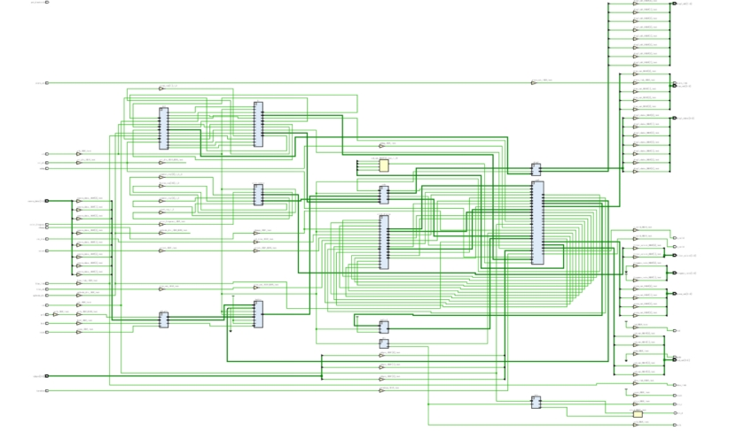 

**Corresponding RTL design schematic:**

 

 

**2, second FPGA development board**

Call module:

MP3 module, Bluetooth module, rotary encoder module

Module introduction:

(1) Frequency division module is used for mp3 and Bluetooth acquisition module evil frequency division, the frequency is 0.5MHz as the frequency of audio

(2) The Bluetooth module is used to obtain information such as raised volume and lowered volume sent by the mobile phone, and pass it to the first fpga board for processing, and present the processed result on the vga, but it needs to be realized through the Bluetooth module to perform corresponding filtering processing on this board before ZHE

(3) The volume adjustment module, after the corresponding delay according to the volume operation (increase the volume and decrease the volume) obtained after the conversion of the incoming Bluetooth information.

(4) LED/7 segment digital tube display module, which is used to convert the sound information to the corresponding 16-bit LED light for display according to the data of the currently playing music MID the current frame.

**Corresponding synthesis design schematic:**

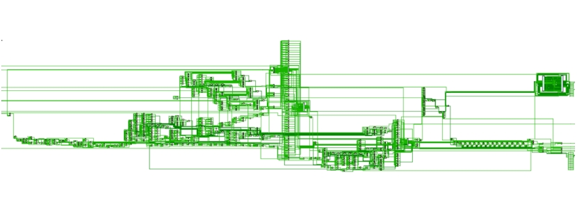 

**Corresponding RTL design schematic:**! [img] (./ pic /wps112.jpg)

**Modeling of Subsystem Modules**

 

### **top level module: carset_top**

As FPGA The top module of the first board is used to connect the subordinate modules in series, and at the same time provide a direct interface to peripherals to ensure data transmission between each sub-module

```C++
//
/* Module name: module carset_top
/* Function description: As FPGA first board topmost module, used to series subordinate modules,
/* At the same time, it provides an interface directly to peripherals to ensure that each sub-module
/* data transfer
//
```

Module call block diagram display:

Introduction to Module Flowchart:

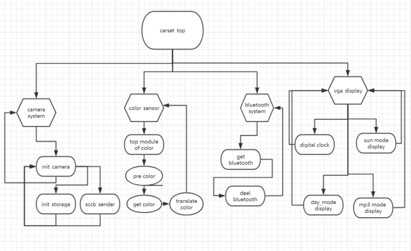 

**1.1***carset_top Main Module Introduction**

**1.1.1 Color Sensor Main Block**

The main module of the color sensor calls the white balance subsystem to first make the subsystem present a white balance state. On this basis, the color recognition subsystem is called. Through the color sensor, after receiving the signal of the white balance module, the RGB The filter of the color sensor is turned on for a corresponding long reference time, and the number of pulses measured in this period of time is recorded to obtain the RGB value of the color. Finally, the color data transmission processing module is called to transmit the data obtained by the color sensor to the main module.

```verilog
module Top_module_of_color(
input clk,
input frequncy,
output [1:0] filter_select,
output [1:0] frequncy_rate,
output led,
output [9:0] r,g,b
    );
endmodule 
```

**1.1.1.1 White Balance Subsystem Module**

The color sensor must go through white balance before it can be used. The so-called white balance is to tell the sensor what white is. Theoretically, white is formed by mixing equal amounts of red, green and blue; but in practice, the three primary colors in white are not exactly equal, and for the TCS3200 light sensor, its sensitivity to these three basic colors is not the same, resulting in the TCS3200's RGB The output is not equal, so the white balance must be adjusted before the test, so that the TCS3200 is equal to the three primary colors in the detected "white". When I implemented this system, I used the method of constant number timing, that is, the three color filters are sequentially gated, and then the output pulses of the TCS230 are counted in sequence. When the count reaches 255, stop counting and calculate the time used for each channel separately. These times correspond to the time reference used by each filter of the TCS230 in the actual test, and the number of pulses measured during this time is the corresponding value of R, G and B.

```verilog
module pre_white(
 input clk,
 input frequncy,
 output reg[63:0]R_time,
 output reg[63:0]G_time,
 output reg[63:0]B_time,
 output ready,
 output reg [1:0] filter_select
    );
endmodule 
```

**1.1.1.2 color recognition subsystem:**

After receiving the signal of the white balance module, the color recognition module starts to work. RGB The filters are turned on for a corresponding reference time, and then the number of pulses measured in this period of time is recorded, thereby obtaining the RGB value of the color.

```verilog
module get_color(
input ready,
input clk,
input frequncy,
input [63:0] r_time,
input [63:0] g_time,
input [63:0] b_time,
output reg [9:0] red,
output reg [9:0] green,
output reg [9:0] blue,
output reg [1:0] filter_select
);
endmodule 
```

**1.1.1.3 data transmission subsystem**

Receive the pulse data identified by the color sensor, process it with the corresponding rgb value rgb value, convert it into a form that other modules can easily call and transmit it to the main module

```verilog
module translate_color(
input ready,
input [1:0]filter_select_balance,
input [1:0]filter_select_identify,
output  reg [1:0] filter_select_out
    );
endmodule 
```

**1.1.2 Flowchart of the corresponding module of the color sensor:**

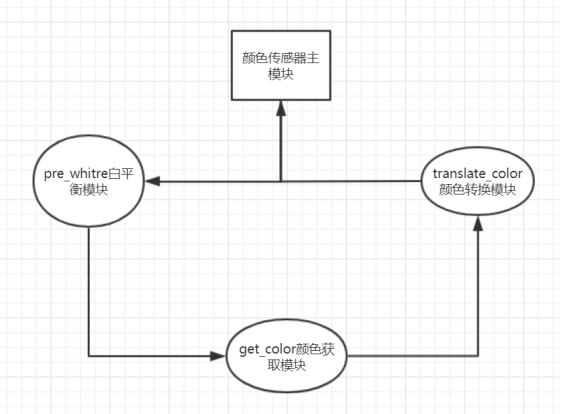 

 

**1.2 Introduction of camera related modules**

The camera related module mainly adopts the SCCB protocol. Generally, the relevant registers of the camera are initialized and configured through the SCCB protocol and the given register configuration, so that it can display the correct image. Secondly, the pixel information of the camera is obtained by get_camera and stored in the instantiated IP core. The whole process consists of a three main modules

A) Camera initialization module init_camera

B) Camera acquisition data module get_camera

C) instantiate the camera register to store the IP core module mem_blk_0

The init_camera consists of two sub-modules: sccb_sender, which is used to send the specified data through the sccb protocol; init_storage, which sequentially stores the register information to be configured.

**Introduction to SCCB**

SCCB is a bus developed by OmniVision and widely used in OV series image sensors, so the general use of OV image sensors is inseparable from the SCCB bus protocol.

It can be colloquially said that SCCB has two working modes, one master and multiple slaves, and one master and one slave mode.

1, a host multi-slave, that is, 3-wire operation: (through the control enable terminal SCCB_E control the selected slave)

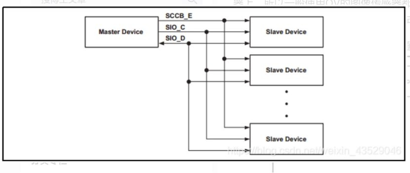 

One master and one slave, that is, 2-wire operation: (default SCCB_E is pulled down)

 

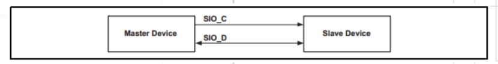 

When writing data to the slave is defined as write transmission, when reading data from the slave is defined

It means read transmission, each transmission must have a start and an end to Release the bus

(start + sotp) 

Complete data transmission consists of two or three stages, each stage contains 9 bits of data, of which the highest 8 bits are the data to be transmitted, and the lowest bit has different values according to the situation of the device: Each stage consists of: 8 bits of data + don't care/NA If the host sends data, that is, write operations, the ninth bit is don't care If the data is sent from the machine, that is, read operations, the ninth bit is NA During device read operation, the lowest bit of the first stage is the free bit, and the lowest bit of the second stage is the NA write operation. The three stages constitute a transmitted write, and each stage is 9 bits.

ID address (7-bit ID address + 1-bit read-write control + don't care) + register address to write (8-bit

Register address + don't care) + data to be written (8-bit data + don't care) It should be emphasized that the ID address is written as 8'h60, read as 8'h61, 8'h60 is the read and write control bit of the ID address

The read and write control bit of the ID address is 1. The read transmission consists of 2 stages of transmission. There are two transmissions, 2 stages of write transmission + 2 stages of read transmission, each phase is 9 bits, as follows

ID address (7-bit ID address + 1-bit read-write control + don't care) + FPGA To write to the slave the address of the register to be read (8-bit register address + don't care) ID address (7-bit ID address + 1-bit read-write control + don't care) + data (8-bit data + NA) The slave sends the data in the specified register to the FPGA (8-bit data + NA) When the NA bit is in, the host should cooperate to drive the data line to a high level. Note that the first ID address is 8'h60, because it is FPGA the upcoming star write operation The second ID address is 8'h43, because the data is sent from the machine to the FPGA, that is, the read operation is performed. Summarized as: (1) + ID address (60) + register address + stop1 + start 1 + ID address (61) + data + stop2

Why start 1 and start 2 here? Because SCCB does not have the concept of repeating the start, in the read cycle of SCCB, when the host sends the on-chip register address, it must send the bus stop condition. Otherwise, when sending the read command, the slave will not be able to generate a Don't care response signal. That is, every transmission must have a start and an end to Release the bus (start + stop), which is also a place where SCCB is different from I2C. After a data communication (send or receive) has been completed during the master control bus, if you want to continue occupying the bus for another data communication (send or receive) without Release the bus, you need to use the restart signal Sr timing. The restart signal Sr acts as both the end of the previous data transfer and the beginning of the next data transfer. The advantage of using the restart signal is that the master does not need the Release bus between the two communications, so that control of the bus is not lost, that is, other master nodes are not allowed to preempt the bus.

**1.2.1 Introduction init_camera Module**

The calling sccb_sender through the SCCB protocol and a given register configuration (implemented by the init_storage module) to initialize the configuration of the relevant registers of the camera, so that it can display the correct image.

```verilog
module init_camera( 
input Clk,//25MHz input clock
input Rst,//Reset signal, input active high
output sio_c,//sio_c clock
Inout sio_d,//sio_d data side, bidirectional interface
output Reset,//pull up state
output Pwdn,//pull output state
output Xclk//Outward clock, can not be connected
); 
endmodule
```

**1.2.1.1 sccb_sender Module Introduction**

sccb_sender, by controlling the sio_c and sio_d signals to configure the register, sio_c a clock signal, each phase is written for 9 cycles, a total of 27 cycles, after each of the two added delay period, to ensure that the sccb protocol can work properly, so a total of 31 large clock cycles, each cycle and a small clock cycle 1024 is determined, so only the incoming clock can be 25mhz, internal division, sio_d data transmission using serial data transmission, to ensure the reliability of the transmission.

```verilog
module sccb_sender(
 Input clk,//clock signal, incoming 25MHz, internal self-divided frequency
 Input RST,//Reset signal, active high
inout sio _ d,
    output reg sio_c,
    input [7:0]slave_id,
    input [7:0]reg_addr,
    input [7:0]value
);
Endmodule 
```

**1.2.1.2 init_storage Module Introduction**

Write the relevant register configuration here, and when the sccb is sent, the counter is incremented to read the data of the next register and configure it.

```verilog
module init_storage(
    input clk,
    input rst,
output reg [15:0]data_out,
);
endmodule 
```

**1.2.2 Image acquisition module get_camera**

Related image signals:

VSYNC, that is, frame synchronization signal, a VSYNC signal indicates that the end of a frame (that is, a picture) of data has been output; HREF /HSYNC, that is, line synchronization signal, an HSYNC signal indicates that the end of a line of data has been output; PCLK, that is, pixel clock, a PCLK clock, output a (or half) pixel, the end of a PCLK signal indicates that a data has been output; image data format: If the image format is set to RGB565, two bytes transmit a RGB Pixel data, when outputting data, 

Because the image information of the OV2640 camera Postback is when the href and vsync signals are both high, pclk rising edge Postback is a message, each two groups constitute a rgb image, so this module is mainly responsible for analyzing the href, vsync, pclk signals, integrating the two sets of data, and providing the correct write valid signal, write data and write position to the cache module according to the cache position coordinates at this time (which determines the position of the picture display)

```verilog
module get_camera (
    input rst,
    input pclk,
    input href,
    input vsync,
 Input [7:0] data_in,//Camera D [9] to D [2]
 output reg [11:0] data_out,//data of one pixel
 output reg wr_en,
 output reg [18:0] out_addr = 0
    );
endmodule 
```

**1.2.3 Picture cache module blk_mem_gen_0**

Called the IP core of vivado, instantiated RAM, cache image data, in which the write enable signal is given through the get_camera, to ensure the normality of writing, read enable signal is true forever, to ensure the continuity of the image.

The module depth: 640 * 480, width 12, each 12-bit width storage unit stores 12-bit rgb value. The specific inxi is shown in the following figure:

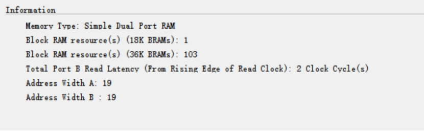 

**1.2 Connect Bluetooth signal processing and connect Bluetooth implementation related modules**

Bluetooth signal processing main module acquires information corresponding to the Bluetooth signal acquisition module by calling the UART protocol, acquires 8-bit data obtained by the Bluetooth transmission, after the filtering process, the corresponding information more Bluetooth module acquires a value corresponding to the transmission of Bluetooth, the frequency division module calls the high-frequency Bluetooth signal is processed in a low-frequency delay manner, thereby avoiding the data transmission signal because of the filtering influence caused by the instability of the data detection deviation.

 

**Introduction to UART**

UART is an asynchronous serial communication protocol, English full name is Universal Asynchronous Receiver / Transmitter that is universal asynchronous transceiver , it is not like SPI and I2C such Communication Protocol, but in SOC is also a more commonly used IP. Its biggest advantage is that only two lines for communication, support full duplex, that is, one line utx for sending data, the other line for receiving data. Two uart communication as shown in the following figure:

 

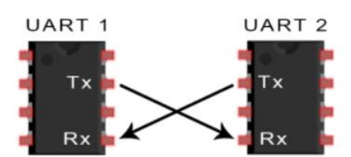

Where the sending UART Parallel data from a control device (such as CPU ) is converted to serial form, which is sent serially to the receiving UART, which then converts the serial data back into parallel data for use in the receiving device. Data flows from the Tx pin of the sending UART to the Rx pin of the receiving UART.

**UART working principle**

UART It is asynchronous communication, which means that there is no clock signal for sampling synchronization of data. Therefore, the UART sending side needs to add start and stop bits to the data packet being transmitted. These bits define the start and end of the data packet, so the receiving UART knows when to start reading these bits. When the receiving UART detects the start bit, it will start reading the input bits at a specific frequency called baud rate. Baud rate is a measure of data transmission speed, expressed as bits per second (bps). Both UARTs must operate at approximately the same baud rate. The baud rate between the sending and receiving UARTs can only differ by about 10%. Both UARTs must also be configured to send and receive the same data packet structure.

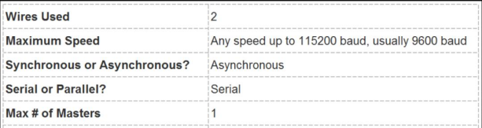

**How it works**

Other devices (such as CPU , memory, or microcontrollers) send data to the UART via the data bus.


Data is transferred in parallel form from the data bus to the sending UART . After the sending UART gets parallel data from the data bus, it adds the start bit, parity bit, and stop bit to create a data packet.

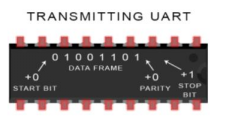

The data packet is output bit by bit serially on the Tx pin, and the receiving UART UART reads the data packet bit by bit on its Rx pin.

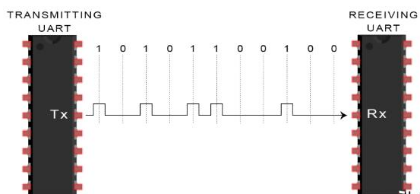

Then, the receiving UART converts the data back into parallel form and removes the start, parity, and stop bits.

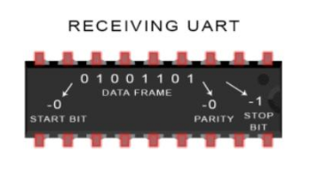

The receiving UART transmits the data packet in parallel to the data bus at the receiving end

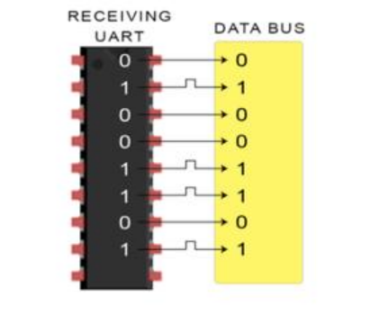

**UART frame structure**

UART Transmitted data is organized into data packets. Each data packet contains 1 start bit, 5 to 9 data bits (depending on the UART), an optional parity bit, and 1/1.5 or 2 stop bits.

Start bit:

UART Data transmission lines are typically held at a high voltage level when not transmitting data. To start a data transfer, the sending UART pulls the transmission line down from high to low for one clock cycle. When the receiving UART detects a high-to-low voltage transition, it starts reading the bits in the data frame at the frequency of the baud rate.

Data bits:

A data frame contains the actual data being transmitted. If the parity bit is used, it can be 5 bits and up to 8 bits. If the parity bit is not used, the length of the data frame can be 9 bits. In most cases, data is sent first in the least significant bit.

Check bit:

The receiver is used for data integrity and correctness checks. This bit is optional and can be configured as odd/even/no check/check bit is always 1/check bit is always 0 option.

Stop bit:

To send a signal to the end of the data packet, the transmission UART UART at least two bit duration of the data transmission line is driven from low to high.

**1.3.1 Bluetooth signal processing and connection main module blue_tooth_link**

This module calls deal_with_bluetooth to analyze the introduced Bluetooth data, and add filtering processing. Call the divider module to divide the 100MHz frequency by 1MHz to convert the processed Bluetooth signal into information and convert it into other Pattern Recognition volume adjustment data, track adjustment data, day and night mode adjustment data, etc.

```verilog
module deal_blue_link(
    input clk,
    input [7:0] blue_data,
    output [1:0] volum,
    output mp3_mode,
    output [1:0] sun_mode
    );
endmodule 
```

**1.3.2 Bluetooth information acquisition and processing module**

Bluetooth acquisition information processing module using the UART protocol for transmission, the Bluetooth module supports 8 data bits, a stop bit, no parity bit, the baud rate of the default 9600, while in order to ensure the effective transmission of data, adding a filter processing module, the incoming clock is 100Mhz.

```verilog
module deal_bluetooth(
    input  wire clk, 
    input [7:0] oper,
    output reg up,
    output reg down,
    output reg sunchange,
    output reg mp3change
);
endmodule 
```

**1.3.3 Bluetooth information change module**

By processing the Bluetooth information obtained by the Bluetooth information to change the volume, mp3 mode change, VGA display change signal transition, thereby transforming the data mode of this type is called by other modules.

```verilog
module changeinfo (
    input clk,
    input up,
    input down,
    input sunchange,
    input mp3change, 
    output reg [1:0] volum,
    output reg mp3_mode,
    output reg [1:0] sun_mode
);
endmodule 
```

**1.3 Display rendering subsystem:**

The display module presentation subsystem adopts the form of vga to display the module. The display and presentation content includes the following aspects:

(1) The background image of the vehicle system is called according to the background image information stored in the ROMip core, and the picture data in the IP core is loaded into the vga for full-screen display. The vga module displays it.

(2) Digital clock display

After the on-board system is turned on, the digital clock automatically starts timing, and at the same time displays the numbers on the vga according to the font. The zero setting operation can be turned on as needed. When the whole point is reached each time, it sends back information from the "first fpga board" to the "second fpga board" for fatigue driving reminder.

(3) Camera image rendering area

In the range from XXX to XXX at the bottom left of the vga, the image captured by the camera is presented. It is displayed by reading the data that exists in the ip core of the picture, so as to achieve the effect of presenting the information captured by the camera. It is used to monitor the vehicle in front or behind during the actual driving process and present it on the display in time to remind the driver.

(4) Mode display module

Change module calls the information stored in the ip core which is displayed in the form of a pattern, is determined according to different Bluetooth transmission data (such as raise the volume, lower the volume, play tracks, turn off the mp3, open day/night/smart mode) mode switching, so as to achieve the effect of the display processing module is changed.

**VGA Timing Introduction:**

Display scanning mode is divided into progressive scanning and interlaced scanning: progressive scanning is scanning from the upper left corner of the screen, scanning from left to right point by point, after each scan line, the electron beam back to the start position of the next line on the left side of the screen, during this period, the CRT blanking of the electron beam, at the end of each line, the line sync signal is synchronized; when all lines are scanned, a frame is formed, the field sync signal is used for field synchronization, and the scan is returned to the top left of the screen, while field blanking, the next frame starts. Interlaced scanning refers to scanning every other line when the electron beam is scanning. After completing one screen, it comes back to scan the remaining lines. The interlaced monitor flashes violently, which will make the user's eyes tired. The time to complete a line of scanning is called the horizontal scanning time, and its inverse is called the line frequency; the time to complete a frame (full screen) scanning is called the vertical scanning time, and its inverse is called the field frequency, that is, the frequency of refreshing a screen, common 60Hz, 75Hz, etc. Standard VGA display field frequency 60Hz, line frequency 31.5KHz. Line field blanking signal: It is for the imaging scanning circuit of the old picture tube. The beam emitted by the electron gun starts to scan from the upper left corner of the screen to the right. After scanning one line, the electron beam needs to be moved from the right to the left so that the second line can be traced. During the movement, a signal must be added to the circuit so that the electron beam cannot be emitted. However, this Re-sweep line will destroy the screen image. It is also a reason that the signal that prevents the Re-sweep line from being generated is called the blanking of the blanking signal field signal.

Display Bandwidth: Bandwidth refers to the frequency range that the monitor can handle. If it is a VGA with a refresh rate of 60Hz, the bandwidth is 640x480x60 = 18.4MHz, and the refresh rate of 70Hz is 1024x768 resolution SVGA, and its bandwidth is 1024x768x70 = 55.1MHz. Clock Rate: Taking 640x480@59.94Hz (60Hz) as an example, each field corresponds to 525 line cycles (525 = 10 + 2 + 480 + 33), of which 480 is a display line. Each field has a field synchronization signal, the pulse width is a negative pulse of 2 line cycles, each display line includes a clock of 800 points, of which 640 points are the effective display area, and each line has a synchronization signal, and the pulse width is 96 point clocks. It can be seen that the line frequency is 525 * 59.94 = 31469Hz, and the point clock frequency is required: 525 * 800 * 59.94 about 25MHz.

VGA Sequence Diagram:

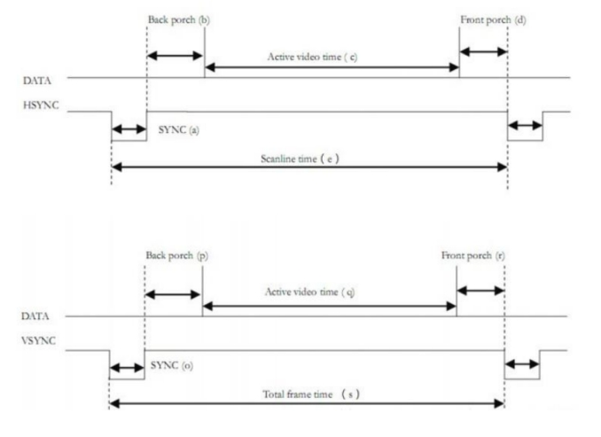 

 

**1.3.1 vga display main module**

The role of the module is to accept Bluetooth data, picture data, camera data and other comprehensive data into the module, more data of different modules in the corresponding position to display the integrated system, with 6 IP core mode:

1, camera data storage RAM IP core

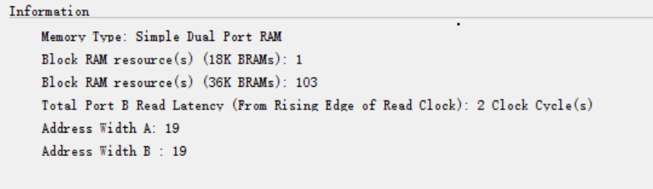 

2, picture data storage ROM IP core

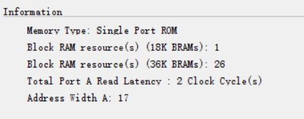 

3, digital clock type storage ROM core

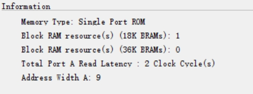 

4, mp3 mode image mode storage ROM IP core

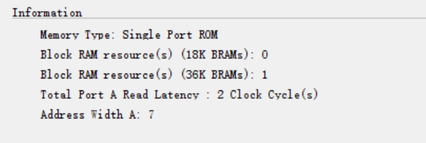 

5, day/night mode switching mode ROM ip core

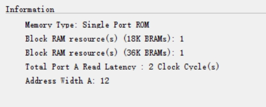 

6. Mp3 volume storage display mode:

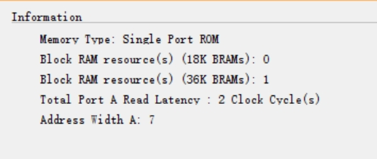 

According to the mode data core of Bluetooth transmission, the image information read by the corresponding position of the IP core and the image information captured by the camera, combined with the data, the overall presentation of the final intelligent driving vehicle system is obtained:

Self-created image storage method - introduction to "graph model":

During the experiment, we need to store not only the pixel data captured by the camera, but also the background image and the VGA display picture data regulated by related control signals, as well as the display of the digital clock. The size of the IP core provided to us by vivado does not exceed 270 storage units, and its storage capacity is less than two 640 * 480 pixel image data. How to compress and render images in this case is a problem we have studied more during the experiment.

Because it is impossible to store the image in a small space, we use other data compression methods. Since most of the charts of the image appear in black and white, we innovatively adopt the "graph mode" method and the compression of the retrograde image, and store the three-digit hexadecimal number of the corresponding picture rgb The value is changed to 1 bit for storage, the storage size of each line width is changed from 12 to 1, and the compression cost for the "icon" image is reduced to 1/12 of the original. The algorithm is implemented by the handwritten python Algorithm, and the specific model effect is as follows:

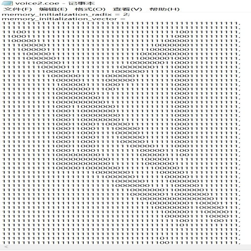 

The compressed python code is as follows:

```python
from PIL import Image
im=Image.open("D:\\ProgramFiles\\vivado_file\\pic_sources\\benben\\9.png")
f=open("D:\\ProgramFiles\\vivado_file\\pic_sources\\benben\\9.coe","w")
width = im.size[0]
height = im.size[1]
rgb_im = im.convert('RGB')
print(width)
print(height)
print(width*height)
print(hex(15))
print(str(hex(15))[-1:])
f.write("memory_initialization_radix = 16;\n")
f.write("memory_initialization_vector =\n")
for i in range(height):
    for j in range(width):
        r, g, b = rgb_im.getpixel((j,i))
        r=r//200;
        f.write(str(hex(r))[-1:])
        outCount+=1;
        if outCount==48:
            f.write(",\n")
            outCount=0;
```

### **2. second fpga development board - top module MY_MP3**

MY_MP3 module bits of the second top-level module, including a series of subordinate modules, while providing an interface directly to the peripherals, to ensure data transmission between the respective sub-modules, the development board calls the main module bit Bluetooth module core mp3 module, is mainly responsible for the function bits related to the regulation of mp3 playback and vehicle driving mode via Bluetooth data transmission.

```
//
/* Module name: module MY_MP3
/* Function description: As FPGA second board topmost module, used to series subordinate modules,
/* At the same time, it provides an interface directly to peripherals to ensure that each sub-module
/* data transfer
//
```

Introduction to Module Flowchart:

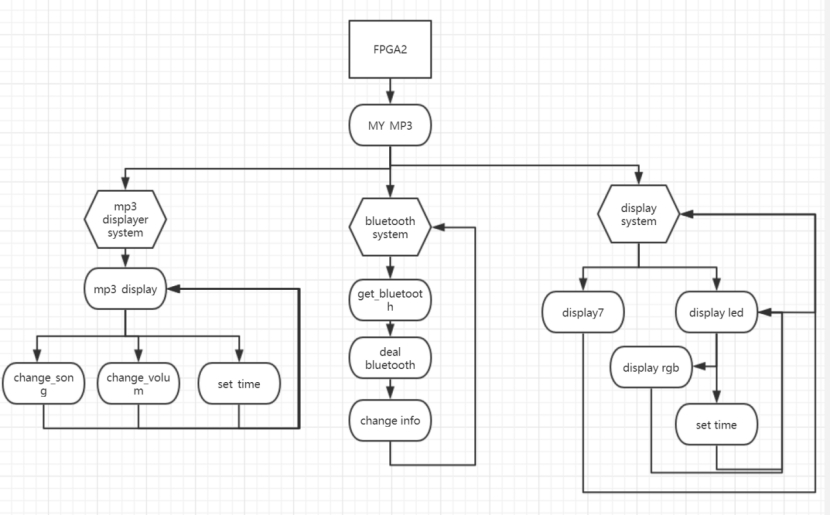 

 

**2.1 MP3 audio playback related modules**

MP3 related modules are the basic modules to realize mp3 functions, including button control volume adjustment, rotary encoder control, song switching, digital clock time calculation and presentation. Specifically, it includes volume adjustment sub-module, rotary encoder to obtain left rotation and right rotation information module, song switching sub-module, seven-segment digital tube presentation sub-module, LED dynamic audio display sub-module, etc.

**Introduction SPI Communications**

VS1003 BMP3 Board module is connected with external controller through SPI interface, VS1003 control and audio data are through SPI interface, VS1003 through 7 signal lines common controller, namely: xRSET, XCS, XDCS, SI, SO, SCK and DREQ.

1. VS1002 valid mode (ie new mode).

2. VS1001 compatibility mode. Here we only introduce the effective mode of VS1002 (this mode is also the default mode of VS1003). The following table is the SPI signal line function description of VS1003 in the new mode:

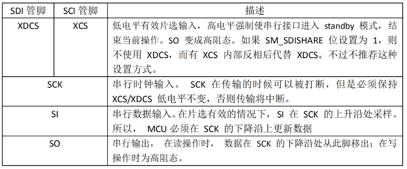 

VS1003's SPI data transmission, divided into SDI and SCI, SDI is used to transmit data, SCI is used to transmit commands. SDI data transmission is very simple, that is, standard SPI communication, but the data transmission of VS1003 is controlled by DREQ. The host must judge that DREQ is valid (high level is valid) before it can send data, which can send 32 bytes each time.

The SCI serial bus command interface contains an Instruction byte, an address byte, and a 16-bit data word. read

A write operation can read and write a single register, and read data bits on the rising edge of SCK, so the host must refresh the data on the falling edge. The byte data of SCI is always the high bit before the low bit after. The first byte Instruction byte has only 2 Instructions, that is, read and write. The read Instruction is: 0X03, and the write Instruction is: 0X02.

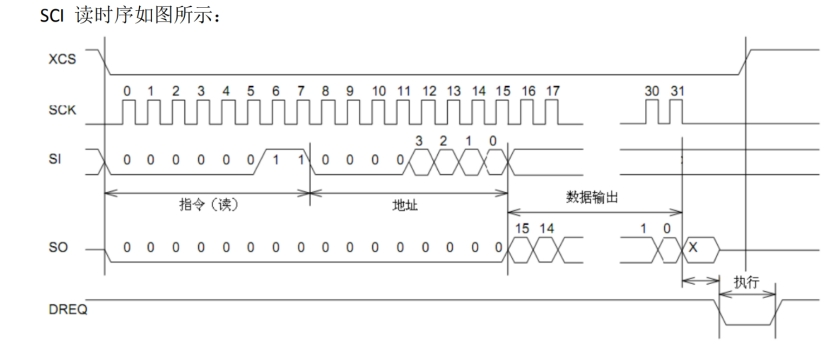 

As can be seen from the above figure, reading data to VS1003, by first pulling down the XCS, then sending a read Instruction (0X03) and then sending an address, finally, we can read the output data on the SO line (MISO). At the same time SI (MOSI) data will be ignored.

The write timing of SCI is as follows:

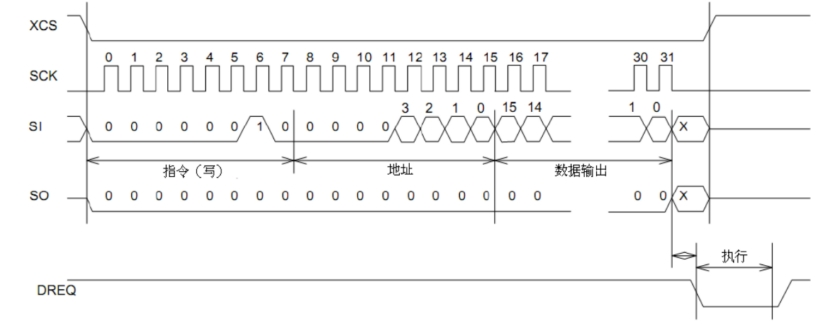 

The SCI write timing is similar to the SCI read timing in that the instruction is sent first, and then the address is sent. However, in the write timing, our Instruction is a write Instruction (0X02), and the data is written to VS1003 through the SI, SO has been kept low. In the above two figures, the DREQ signal generates a short low pulse, which is the execution time. During this time, no external interruptions are allowed.

**2.1.1 MP3 main module**

The main module of MP3 mainly controls the VS1003BMP3 Board, and transmits information to the VS1003BMP3 Board according to the write sequence of SCI through the audio data pre-stored in the second FPGA development board, thereby controlling its audio playback. There are volume control sub-modules and song switching sub-modules.

1) Implementation process

The SCI serial bus command interface contains an Instruction byte, an address byte, and a 16-bit data word. Read and write operations can read and write a single register, and read data bits at the rising edge of SCK, so the host must refresh the data on the falling edge. The byte data of SCI is always the high-order byte before the low-order byte. The first byte of Instruction has only 2 Instructions, that is, read and write. The read Instruction is: 0X03, and the write Instruction is: 0X02.

In the transmission process, we mainly use the "write Instruction" method to transfer the data from the FPGA development board into mp3 for playback. First, by first lowering the XCS, then sending a write and read Instruction (0X02) and then sending an address, and finally, sending the 16-bit audio data along the SI bus.

2) Audio selection

16-Bit audio data is MIDI file format audio data (compared with the original data length of 32 mp3 format, MIDI file does not need to adjust the length or other format information after processing by hexadecimal encoder, it can be sent directly to), first through the hexadecimal encoder to convert it into the hexadecimal encoding of A65 format, through the C program to convert its bits COE file in a certain retrieval order stored in the IP core. The corresponding interface definition is as follows:

```verilog
module BLUE_MP3(
    input CLK,
    output reg XRSET=1,
    output reg XCS=1,
    output reg XDCS=1,
    output reg SI=0,
    input SO,
    output reg SCLK=0,
    input DREQ,
    input rst,
    input next,
    input prev,
    input up,
    input down,
    output disp7_dot,
    output [7:0] disp7_shf,
    output [6:0] disp7_odata,
    output [15:0] led,
    output [2:0] led_rgb,
//bluetooth
    input get_bluetooth,
//connect
    output blue_link,
    input iA,
    input iB,
    input SW
);
endmodule 
```

**2.1.2 Volume Adjustment Module**

The volume adjustment module processes the volume control signal transmitted by Bluetooth or rotary encoder, and if the volume increase signal is sensed, the volume increase vol volume information is transmitted to the main module MP3 by a certain delay, otherwise the volume information after transmission is lowered to the main module

```verilog
module inputvol(
    input clk,
    input up,
    input down,
    output reg [15:0]vol=16'h0000
    );
endmodule 
```

**2.1.3 Song switching module**

And the volume adjustment module is similar, the song switching module is also processed by the control signal for switching the song on the access button transmission Bluetooth or the second fpga development board, if the volume increase signal is sensed, by a certain delay transmission switching song signal sw information to the main module among MP3, otherwise the volume information transmitted to the main module which drops.

```verilog
module inputsw(
    input clk,
    input prev2,
    input prev,
    input next2,
    input next,
    output reg [2:0]sw=0
    );
endmodule

```

**2.1.4 mp3 digital clock module**

Mp3 digital medium module, call the frequency divider, demonstrate the discipline according to the speed of the United States once a second, and return the "minutes and seconds" result to the mp3 main module, and call the 7-segment digital tube module to display the sound information.

```verilog
module mustime(
    input clk,
    input rst,
    output reg [15:0] timet=0
    );
endmodule
```

**2.2 mp3 display related modules**

In order to increase the effect of the entire mp3 display, and in order to facilitate debugging, we make full use of the display device of the fpga board, and will be able to use the central LED light, 16-minute LED light, and seven digital tubes as our audio display device.

**2.2.1 Seven-segment digital tube display module**

The seven-segment digital tube is the basic monitor, displaying basic music playback information. The two leftmost bits are the volume adjustment signal, 10 is the volume down, 01 is the volume up, and 00 is the temporary no control signal; the next two bits are the track switching selection signal, 0-7 respectively, indicating the number of songs currently playing, the last four digits indicate the current music playback time, the "minute" information before the time-sharing point indicates the currently playing "second" information after the time-sharing point indicates the currently playing "second" time information.

**2.2.2 Central 16-color LED lamp dynamic display module**

The central LED dynamic display module can be processed with the current audio signal, and the central control LED lamp plus different music frequency dynamic color effects according to different music playback frequencies. The same method is also used for 16 LED lamp positions

**2.2.2.1 LED to different LED frequency signal processing module**

The lighting frequency of the corresponding LED is given through the current audio signal value (directly control the brightness of the corresponding position LED)

```verilog
module timebcd(
    input [15:0] iData,
    output [15:0] oData
);//corresponds to iData% 10; (iData/10) % 6; (iData/60) % 10; iData/600; four different frequency signal processing
endmodule
```

**2.2.2.2 Central led corresponding processing module for different rgb colors**

The rgb value of the central LED is given by the current audio signal value, and the audio information iData is given by the 16-bit audio information obtained from the corresponding address in the ip core.

```verilog
module disprgb(
    input clk,
    input [15:0]led,
    input rst,
    output  [2:0]rgb
);
endmodule 
```

**2.3 Bluetooth signal processing related modules**

Obtain the binary data sent by the operator through Bluetooth, and convert it corresponding to the Instruction signal represented by the encoding: including: volume adjustment signal, track switching signal, mode adjustment signal, etc., avoid filtering interference through the "one-to-one" method. Each signal is stored in 8-bit binary number. Convert the final result into a form that other modules can call and transmit it to the main module.

**2.3.1 Bluetooth information acquisition module**

Bluetooth module using the UART protocol for transmission, the Bluetooth module supports 8 bits of data, a stop bit, no parity bit, the baud rate of the default 9600, while in order to ensure the effective transmission of data, plus filtering processing module, the incoming clock is 100Mhz.

```verilog
module bluetooth(
    input clk,
    input rst,
    input get,
    output reg [7:0] out
);
endmodule 
```

**2.3.2 Bluetooth information processing module**

Filtering process is performed among the modules to ensure that when the timeliness of the data acquired within the delay time are the target data, i.e., the result of the true value is assigned to the target data information, while converting the target data information can be called by other modules in the form of return to the main module which is stored.

```verilog
module deal_bluetooth(
    input  wire clk, 
    input [7:0] oper,
    output reg up,
    output reg down,
    output reg prev,
    output reg next,
    inout mp3change,
    output reg sunchange
    );
endmodule 
```

## **Testbench evaluation module**

1. camera part: 

For testing the sccb protocol

```verilog
`timescale 1ns / 1ps 
module test; 
reg clk=0; 
reg rst=0; 
wire sio_d; 
wire sio_c; 
wire reset,pwdn,xclk; 
always 
begin 
#3; 
clk=~clk; 
end 
camera_init a(clk,rst,sio_c,sio_d,reset,pwdn,xclk); 
//assign sio_d=1; 
endmodule
```

2. The mp3 part is used to test the mp3 channel information:

```verilog
`timescale 1ns / 1ps
module sw_test(
    input clk,
    input prev,
    input next,
    output reg [2:0]sw=0
    );
    reg  [31:0]swdelay=0;
    always @(negedge clk) begin
        if(swdelay==0) begin
            if(prev) begin
                swdelay<=10;
                sw<=sw-1;
            end
            else if(next) begin
                swdelay <= 10;
                sw<=sw+1;
            end
        end
        else 
            swdelay<=swdelay-1;
    end
endmodule
module sw_tb;
    reg clk=0;
    reg prev=0;
    reg next=0;
    wire [2:0]sw;
    always begin

        clk<=~clk;
        #1;
    end
    sw_test psw(.clk(clk),.prev(prev),.next(next),.sw(sw));
    
    initial begin
        #10;
        prev=1;
        #10;
        prev=0;
        #20;
        next=1;
        #10;
        next=0;
        #20;
        next=1;
        #10;
        next=0;
    end
endmodule
```

## **Experimental results and display**

1. Overall interface status display of intelligent vehicle system:

The camera shooting scene is located in the central left part of the entire vehicle system. The three signs in the figure below indicate the state of mp3, the playback volume value of mp3, and the currently selected mode (the smart mode is black, indicating that the color sensor automatically adjusts the day/night mode, and the middle is black to indicate that the manual mode is turned on, and the current background day/night mode is manually adjusted through Bluetooth).

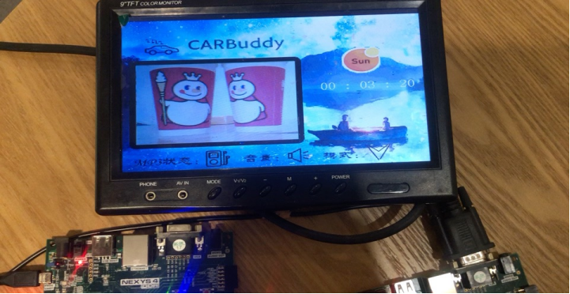 

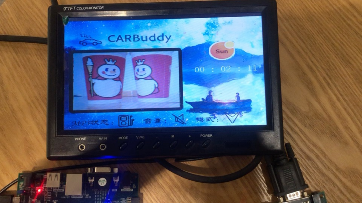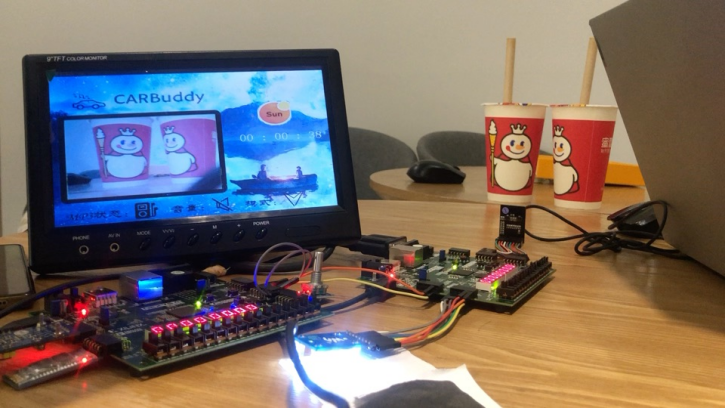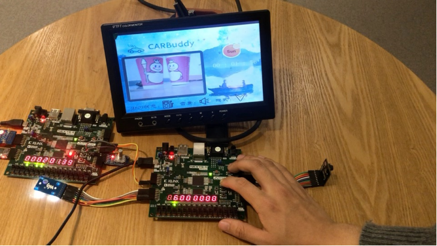 

 

2. Intelligent vehicle system rotary encoder control volume rendering display:

(The leftmost two bits of data on the 7-segment digital tube represent left and right rotation information, 10 means right-handed, 01 means left-handed, and 00 means that the current rotation has not entered the state for the time being)

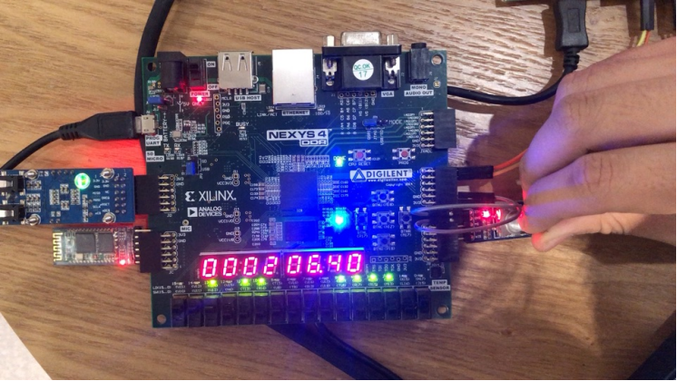 

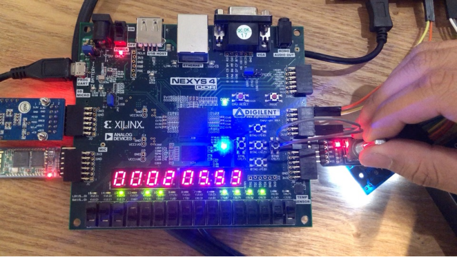 

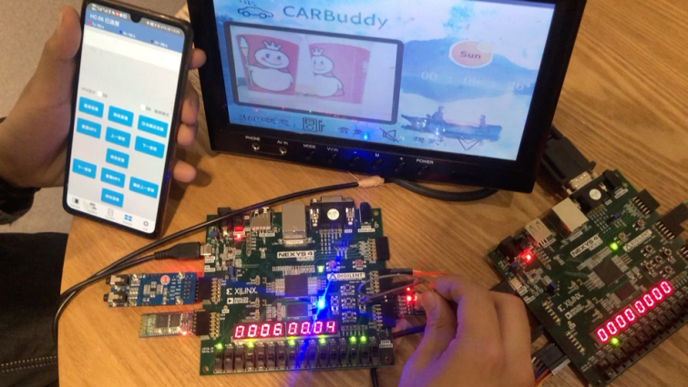 

3. The color sensor subsystem adjusts the picture background renderings according to the current color

(7-segment digital tube values 1-8 indicate that the current background color is the lightest - > the brightest):

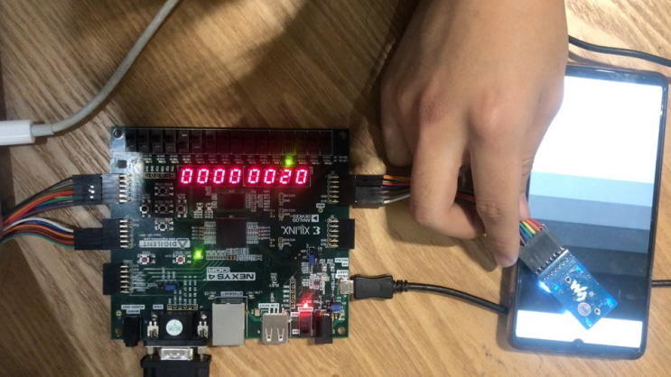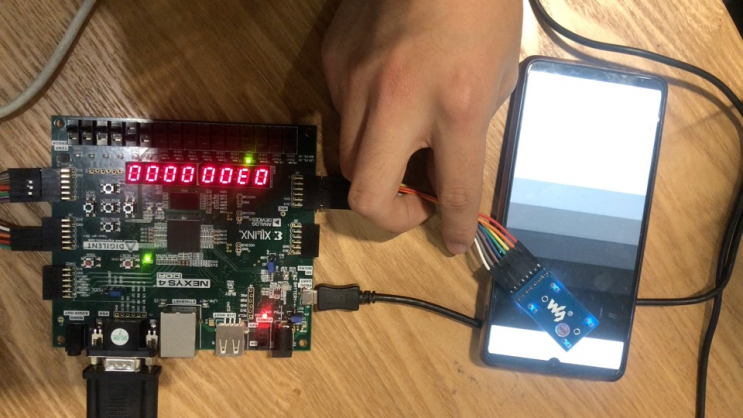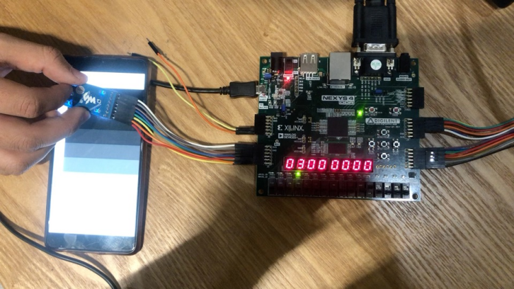 

 

4. Bluetooth module, the mobile phone sends the corresponding 8-bit binary value by controlling the Bluetooth serial port tool, regulating volume switching, track switching, mp3 status, and day/night/smart mode

​		(1) Volume switching

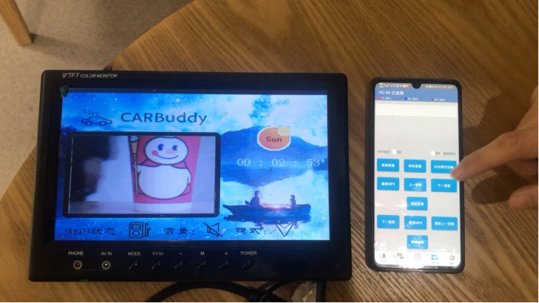 

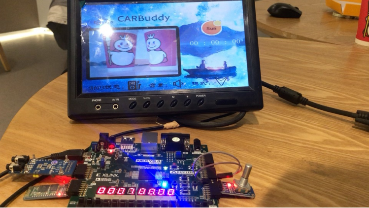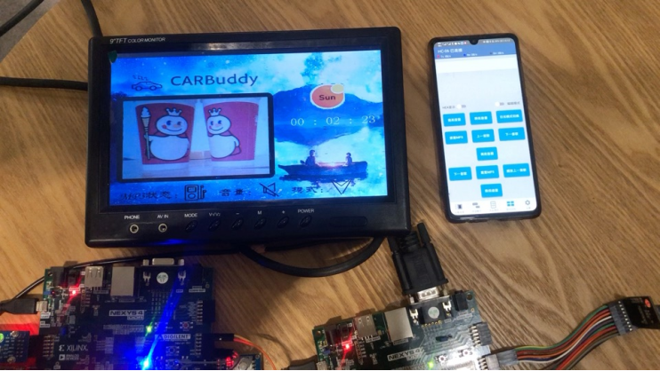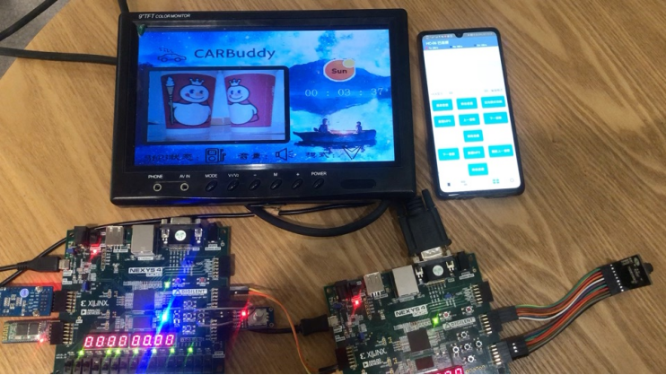 

​			(2)Day and night mode control:

Day mode:

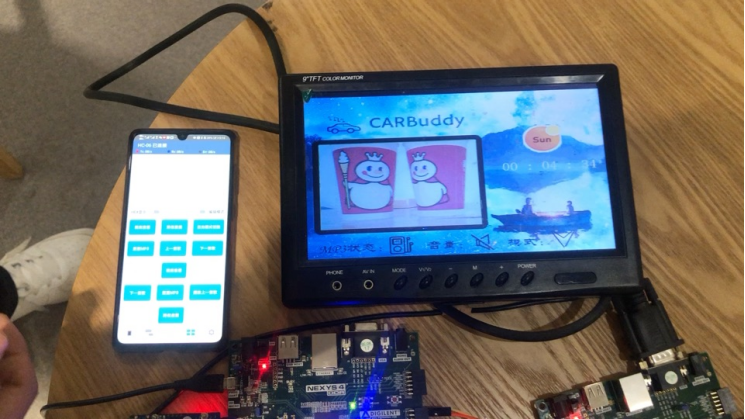 

Night mode:

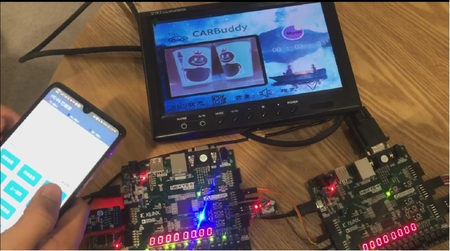 

Color sensor intelligent switching mode:

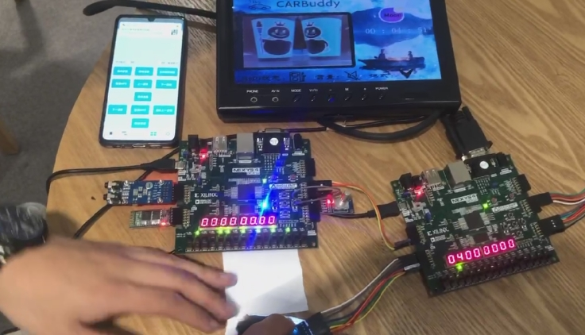 

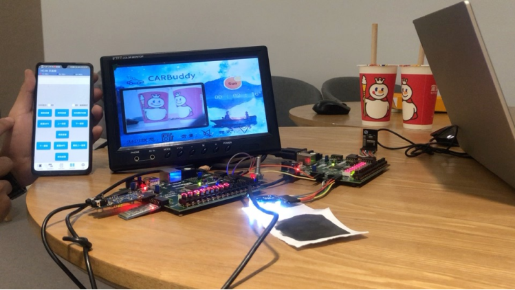 

​			(3) MP3 playback state switch:

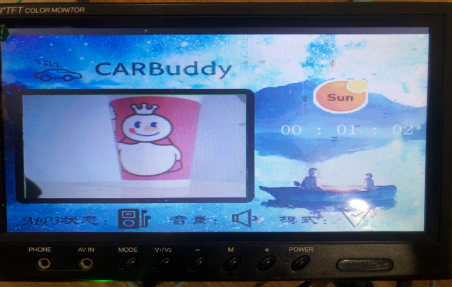

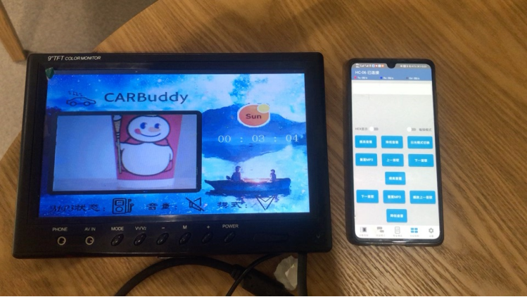 

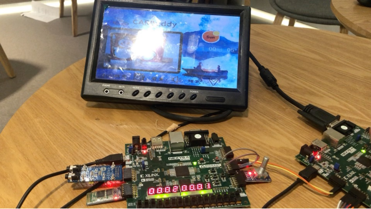 

5. Custom adjustment background image color function display:

According to the fpga board, the third left switch up and down indicates that the r, g, and b values of the background image are adjusted, click the P17 button to turn up the hue, and click the M17 button to turn down the hue. According to the user's preference, the hue of the background image can be adjusted accordingly.

​		(1)Bright color effect (r, g, b values are all turned up)

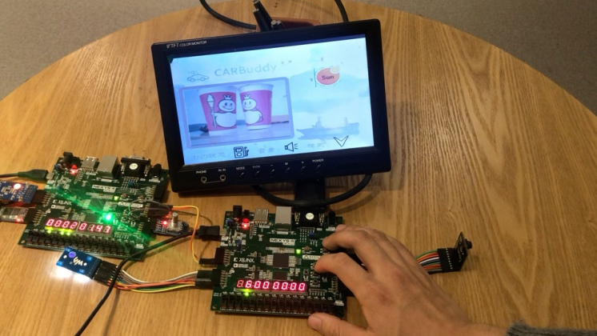 

​		(2) The main red tone effect:

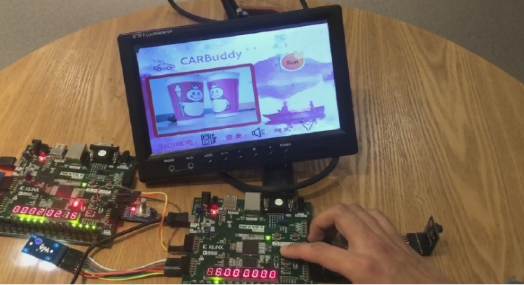 

​		(3) Contrast main red tone effect

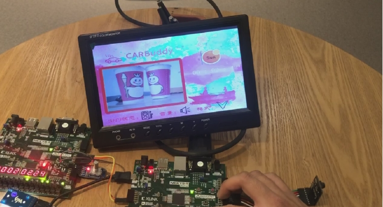 

6. Overall display of the connection status of the dual fpga boards:

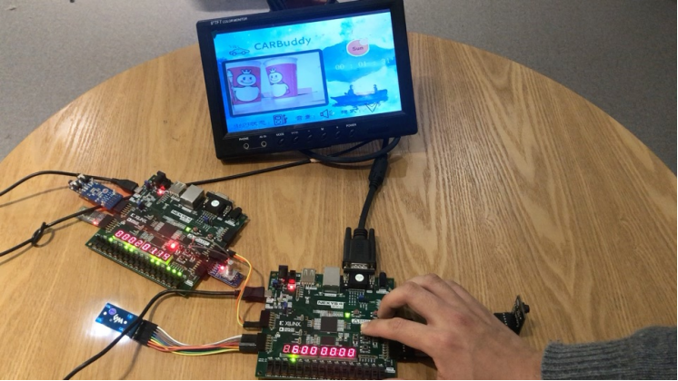 

