# carset-fpga

# 智能车载系统CARBuddy设计

**1、行车记录功能：**

利用 OV2640 摄像头捕捉车辆行驶过程中所拍摄下的图像信息，通过 FPGA 板进行图像缓存以及对图像信 息进行加工处理，再通过 VGA 在显示屏上实时显示图像。

**2、白天黑夜模式调节功能：**

**（1）手动模式：**

通过在手机上使用蓝牙，手动切换白天和黑夜模式，通过“第一FPGA板”对缓存后图像的像素点进行加工处理，白天显示正常颜色，夜间打开黑夜模式后显示反差色，更有助于在夜间情况下观察到前方车辆或障碍物的动向。

**（2）智能模式**

通过颜色传感器自动监控周围环境颜色和亮度自动切换白天和夜间模式。通过“第一FPGA”板对缓存后图像的像素点进行加工处理，白天显示正常颜色，夜间打开黑夜模式后显示反差色，更有助于在夜间情况下观察到前方车辆或障碍物的动向。

**（3）专注模式**

通过打开蓝牙部分的专注模式按钮，可以将整个画面置为全屏放置，方便驾驶员更好的观察行车情况，减少以外的发生。同时也可以点击娱乐模式返回小窗展示模式。

**3、行程时间显示功能：**

机车起动后，会自动进行行车时间显示，在驾驶的过程当中也可自行进行时间控制，清零等操作，通过蓝牙可调节是否启用疲劳驾驶监控模式。打开疲劳驾驶监控模式之后，会初始化两小时疲劳驾驶监控时间，如果时间超过两个小时，则会发出警报，发出的警报基于“第一fpga板”的led灯端口以及“第二fpga板”的MP3播放器提示。

**4、音乐播放功能：**

机车起动后可自动选择是否进行音乐的播放，播放的音乐提前缓存与“第二fpga板”中。在手机上使用蓝牙，可调节mp3上面播放的音量大小以及歌曲的曲目，通过“第一fpga板”，和“第二fpga板”间的通讯，将第二fpga板内的音乐播放数据传输到第一fpga板中。

**二、智能车载系统CARBuddy总体框架**

整个系统分为两个顶层的控制系统，分表控制两个FPGA板，通过两板之间的相互交互实现智能车载系统的所有功能，具体模块设计和分析如下：

**1、第一FPGA开发板**

调用模块：

Vga模块，camera模块，颜色传感器模块

模块简介：

（1）摄像头初始化模块用于根据 SCCB 协议以及寄存器配置来初始化摄像头。 

（2）图像获取模块通过分析摄像头的 href，vsync，pclk 信号来捕获图像信 

息。 

（3）时钟分频模块调用了 IP 核，用于将板内时钟分频，得到不同的时钟信 

号。

（4）图片缓存模块调用 IP 核，用于缓存捕捉到的图像信息。 

（5）图片处理模块对缓存到的图片信息进行加工处理，从而调控蓝牙等多种工具进行具体位置的分析以及所应当添加的滤波的效果。

（6）VGA显示模块将处理后的信息显示，与显示屏交互。  

（8）七段数码管用于显示有第二FPGA开发板所传来的信息，包括音量、歌曲等信息。

（9）颜色传感器模块通过获取当前环境背景颜色的RGB	值，对于行车记录当中所加的滤波进行智能调节。

 

**对应synthesis设计原理图：**

 

**对应RTL设计原理图：**

 

 

**2、第二FPGA开发板**

调用模块：

MP3模块、蓝牙模块、旋转编码器模块

模块简介：

（1） 分频模块用于mp3与蓝牙获取模块恶的分频，频率为0.5MHz作为音频的频率

（2） 蓝牙模块用于获取手机发送的升高音量，降低音量等信息，通过总线传给第一fpga板进行处理，将处理后的结果在vga上面进行呈现，但在zhe之前需要实现经过蓝牙模块在本板上进行相应的滤波处理

（3） 音量调节模块，根据传入的蓝牙信息转化后得到的音量操作（提高音量和降低音量）经过相应的延迟之后。

（4） led/7段数码管展示模块，用于根据当前播放的音乐的MID当前帧的数据，根据声音信息转换到对应的16位led灯上进行展示。

**对应synthesis设计原理图：**

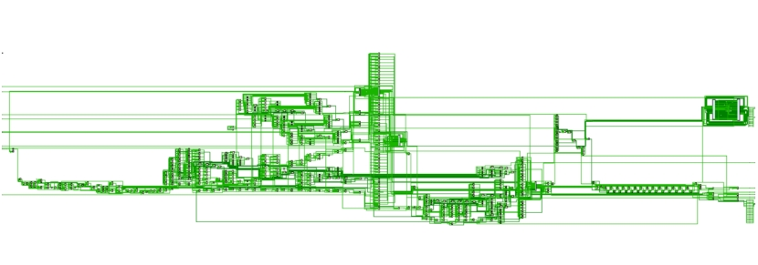 

**对应RTL设计原理图：** 

**四、子系统模块建模** 

 

**1.顶层模块** **carset_top** 

作为fpga第一板最顶层模块，用来串联下属各层模块，同时提供直接对于外设的接口，保证了各个子模块之间 的数据传输

```
//
/*  模块名称：module carset_top
/*  功能描述：作为fpga第一板最顶层模块，用来串联下属各层模块，
/*      同时提供直接对于外设的接口，保证了各个子模块之间
/*      的数据传输
//
```

模块调用框图展示：

模块流程图简介：

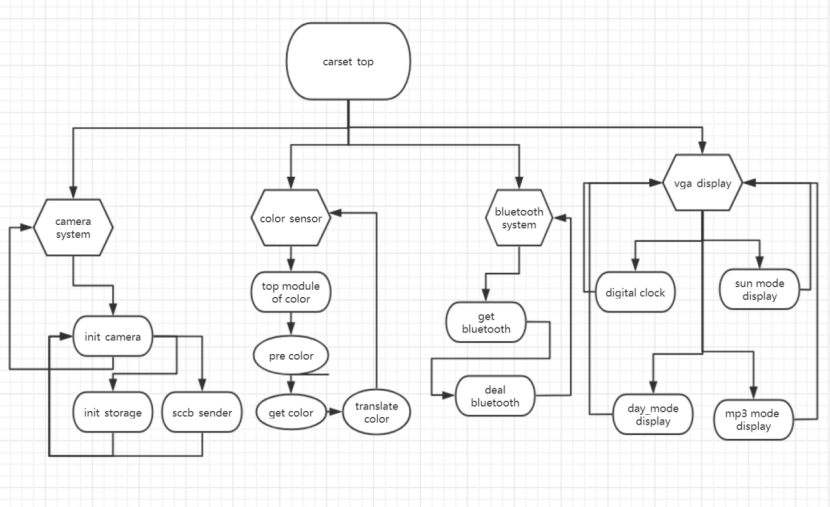 

**1.1** **carset_top主模块简介**

**1.1.1颜色传感器主块**

颜色传感器主模块通过调用白平衡子系统，首先使得子系统呈现出白平衡状态，在此基础上调用颜色识别别子系统通过颜色传感器，在收到白平衡模块的信号后，通过RGB的滤波器分别开启对应的基准时间长，并记录此段时间中测得的脉冲的个数，从而得到到了该颜色的RGB值。最后再调用颜色数据传输处理模块，将颜色传感器所得到的数据传输到主模块当中来。

```verilog
module Top_module_of_color(
input clk,
input frequncy,
output [1:0] filter_select,
output [1:0] frequncy_rate,
output led,
output [9:0] r,g,b
    );
endmodule 
```

**1.1.1.1白平衡子系统模块**

颜色传感器在使用之前必须要先经过白平衡才能使用。所谓白平衡，就是要告诉传感器什么是白色。从理论上讲，白色是由等量的红色、绿色和蓝色混合而成的；但实际上，白色中的三原色并不完全相等，并且对于 TCS3200 的光传感器来说，它对这三种基本色的敏感性是不相同的，导致 TCS3200 的 RGB 输出并不相等，因此在测试前必须进行白平衡调整，使得 TCS3200 对所检测的“白色”中的三原色是相等的。我在实现此系统的时候采用的是定数计时的方法，即依次选通三种颜色的滤波器，然后对 TCS230的输出脉冲依次进行计数。当计数到255 时停止计数，分别计算每个通道所用的时间。这些时间对应于实际测试时TCS230 每种滤波器所采用的时间基准，在这段时间内所测得的脉冲数就是所对应的R 、G 和B 的值。

```verilog
module pre_white(
 input clk,
 input frequncy,
 output reg[63:0]R_time,
 output reg[63:0]G_time,
 output reg[63:0]B_time,
 output ready,
 output reg [1:0] filter_select
    );
endmodule 
```

**1.1.1.2颜色识别别子系统：**

在收到白平衡模块的信号后，颜色识别模块开始工作。RGB的滤波器分别开启对应的基准时间长，然后记录此段时间中测得的脉冲的个数，由此便得到了该颜色的RGB值。

```verilog
module get_color(
input ready,
input clk,
input frequncy,
input [63:0] r_time,
input [63:0] g_time,
input [63:0] b_time,
output reg [9:0] red,
output reg [9:0] green,
output reg [9:0] blue,
output reg [1:0] filter_select
);
endmodule 
```

**1.1.1.3数据传输子系统**

再收到颜色传感器之后的识别的脉冲数据，将其处理位相应准的rgb值，转变为其他模块容易调用的形式将其传输到主模块当中

```verilog
module translate_color(
input ready,
input [1:0]filter_select_balance,
input [1:0]filter_select_identify,
output  reg [1:0] filter_select_out
    );
endmodule 
```

**1.1.2颜色传感器相应模块流程图：**

 

 

**1.2摄像头相关模块介绍** 

摄像头相关模块主要采用SCCB协议的方式，总体上通过 SCCB 协议以及给定的寄存器配置来对摄像头的相关寄存器进行初始化配置，从而使其可以显示正确的图像，其次通过get_camera获取camera的像素点信息，将其储存在实例化的ip核当中。整个过程包含一个三个主模块

a) 摄像头初始化模块 init_camera

b) 摄像头获取数据模块 get_camera

c) 实例化摄像头寄存器存储ip核模块 mem_blk_0

其中init_camera下设两个子模块：sccb_sender，用来通过 sccb 协议发送指定的数据；init_storage，依次存储着要配置的寄存器信息。

**SCCB简介**

  SCCB是欧姆尼图像技术公司（OmniVision）开发的一种总线，并广泛的应用于OV系列图像传感器上，所以一般使用OV的图像传感器都离不开SCCB总线协议。

  可以通俗地讲SCCB有两种工作模式，一主多从，一主一从模式。

1、一主机多从机 也即3线操作：（通过控制使能端SCCB_E控制选中的从机）

 

2、一主一从 也即2线操作：（默认SCCB_E被拉低）

 

 

当写数据到从机被定义为写传输（write transmission），当从机中读数据被定 

义为读传输 (read transmission)，每一个传输都要有开始和结束来释放总线 

(start + sotp) 

完整的数据传输包括两个或三个阶段，每一个阶段包含 9 位数据，其中高 8 位为 所要传输的数据，最低位根据器件所处情况有不同的取值： 每一个阶段组成：8 位数据+don't care/NA 如果是主机发送数据，即进行写操作，第九位就为don't care 如果是从机发送数据，即为读操作，第九位就为 NA. 在进行主器件写操作时，全部阶段的最低位均是 Don’t care bit 在进行主器件读操作时，第一阶段的最低位是自由位，第二阶段的最低位为 NA 写操作是三个阶段构成一个传输的写,每一阶段都是 9 位。

ID 地址（7 位 ID 地址+1 位读写控制+don't care） + 要写的寄存器地址（8 位 

寄存器地址+don't care） +要写入的数据（8 位数据+don't care） 要强调的是 ID 地址，写为 8'h60,读为 8'h61 , 8'h60 即 ID 地址的读写控制位 

为 0，8'h61 即 ID 地址的读写控制位为 1。读传输由 2 个阶段的传输组成，共有两个传输 2个阶段写传输+2个阶段读传输，每一相都是 9 位，具体如下 

ID 地址（7 位 ID 地址+1 位读写控制+don't care）+ FPGA 要向从机写入即将要读的寄存器地址（8 位寄存器地址+don't care）ID 地址（7 位 ID 地址+1 位读写控制+don't care） +从机向 FPGA 发送被指定寄存器里面的数据的数据（8 位数据+NA）在 NA 位的时候，主机要配合将数据线为驱动为高电平。要注意的是第一个 ID 地址为 8'h60，因为是 FPGA 即将要之星写操作第二个 ID 地址为 8'h43,因为是从机向 FPGA 发送数据，即执行的是读操作。总结为: start1+ ID地址（60）+ 寄存器地址 +stop1+start 1 +ID 地址（61）+ 数据 + stop2 

此处为什么要有 start 1 和 start 2 呢？因为 SCCB 没有重复起始的概念，因此在 SCCB 的读周期中，当主机发送完片内寄存器地址后，必须发送总线停止条件。不然在发送读命令时，从机将不能产生Don’t care 响应信号。即每一个传输都要有开始和结束来释放总线 (start +stop)，这也是 SCCB 与 I2C 不同的一个地方。在主控器控制总线期间完成了一次数据通信（发送或接收）之后，如果想继续占用总线再进行一次数据通信（发送或接收），而又不释放总线，就需要利用重启动 Sr 信号时序。重启动信号 Sr 既作为前一次数据传输的结束，又作为后一次数据传输的开始。利用重启动信号的优点是，在前后两次通信之间主控器不需要释放总线，这样就不会丢失总线的控制权，即不让其他主器件节点抢占总线。

**1.2.1** **init_camera模块简介**

调用sccb_sender 通过SCCB 协议以及给定的寄存器配置（由init_storage模块来实现）来对摄像头的相关寄存器进行初始化配置，从而使其可以显示正确的图像。

```verilog
module init_camera( 
input clk,//25mhz 时钟 
input rst,//复位信号，高电平有效 
output sio_c,//sio_c 时钟 
inout sio_d,//sio_d 数据端，双向接口 
output reset,//拉高状态 
output pwdn,//拉低状态 
output xclk//向外时钟，可不接 
); 
endmodule
```

**1.2.1.1** **sccb_sender模块简介**

sccb_sender，通过控制 sio_c 与 sio_d 信号来对寄存器进行配置，sio_c 是时 钟信号，每一相写为 9 个周期，共有 27 个周期，之后前后各加了 2 个期的延时，以确保 sccb 协议可以正常工作，因此共有 31 的大的时钟周期，每一个周期又以 1024 的小时钟周期来决定，因此只需要传入 25mhz 的时钟即可，进行内部分频，sio_d 的数据传输使用串行数据传输，保证了传输的可靠性。

```verilog
module sccb_sender(
    input clk,//时钟信号，传入25MHz,内部自行分频
    input rst,//复位信号，高电平有效
    inout sio_d,
    output reg sio_c,
    input [7:0]slave_id,
    input [7:0]reg_addr,
    input [7:0]value
);
Endmodule 
```

**1.2.1.2** **init_storage模块简介**

将相关的寄存器配置写在此处，当 sccb 发送完毕后，计数器增加，从而读取下一个寄存器的数据并配置。

```verilog
module init_storage(
    input clk,
    input rst,
output reg [15:0]data_out,
);
endmodule 
```

**1.2.2** **图像获取模块** **get_camera**

相关图像信号： 

VSYNC，即帧同步信号,一个 VSYNC 信号结束表示一帧（即一个画面）的数据已经 输出完毕; HREF /HSYNC，即行同步信号,一个 HSYNC 信号结束表示一行的数据已经输出完毕; PCLK，即像素时钟，一个 PCLK 时钟，输出一个(或半个)像素,一个 PCLK 信号结 束表示一个数据已经输出完毕; 图像数据格式： 若图像格式设置为 RGB565，两个字节传输一个 RGB 像素数据，进行数据输出时， D0-D7 数据线在 PCLK 在上升沿阶段维持稳定，并且会在 1 个像素同步时钟 PCLK 的驱动下发送 1 字节的数据信号，所以 2 个 PCLK 时钟可发送 1 个 RGB565 格式的像素数据。当 HREF 为高电平时，像素数据依次传输，每传输完 一行数据时，行同步信号 HREF 会输出一个电平跳变信号间隔开当前行和下一行的数据；一帧的图像由 N 行数据组 成，当 VSYNC 为低电平时，各行的像素数 据依次传输,每传输完一帧图像时，VSYNC 会输出一个电平跳变信号。等待帧同步信号 VSYNC 上升沿，开始读取一帧的数据 在此过程中 VSYNC 保持高电平，每个像素同步信号 PCLK 下降沿，开始读走 8 位 数据线的数据（1 像素），重复 n 次 直到帧同步信号 VSYNC 下降沿，一帧图像数据读取结束 。等待帧同步信号 VSYNC 上升沿，开始读取新一帧的数据。

由于 OV2640 摄像头回传的图像信息是在 href 与 vsync 信号都为高电平时，pclk 上升沿回传一个信息，每两组才构成一个 rgb 图像，因此此模块主要负责对 href，vsync，pclk 信号进行分析，对于两组数据进行整合，并根据此时的缓存位置坐标，向缓存模块提供正确的写有效信号，写数据以及写位置（决定了图片显示的位置）

```verilog
module get_camera (
    input rst,
    input pclk,
    input href,
    input vsync,
    input [7:0]data_in,//摄像头D[9]到D[2]
    output reg[11:0]data_out,//一个像素点的数据
    output reg wr_en,//处理完毕，写有效使能
    output reg[18:0]out_addr=0//缓存位置
    );
endmodule 
```

**1.2.3** **图片缓存模块 blk_mem_gen_0** 

调用了 vivado 自带的 IP 核，实例化了 RAM，缓存图片数据，其中，写使能信号通过过 get_camera 给出，保证了写的正常性，读使能信号则为永真，保证图 像的连贯性。

该模深度：640*480，宽度12，每一个12位宽度的储存单元中存放12位的rgb数值。具体inxi如下图所示：

 

**1.2** **连接蓝牙信号处理及连接蓝牙实现相关模块**

蓝牙信号处理主模块主要通过调用蓝牙信号获取模块获取蓝牙相应的信息，通过UART 协议进行，获取蓝牙传输所得到的8位数据，在进行滤波处理之后，更具蓝牙模块的相应信息获取到对应传输的蓝牙的值，调用分频模块将高频蓝牙信号以低频延迟的方式进行处理，从而避免因为滤波影响导致的数据传输信号不稳导致的数据检测偏差。

 

1UART简介

UART是异步串口通信协议,英文全称是Universal Asynchronous Receiver /Transmitter 即通用异步收发传输器，它不像SPI和I2C这样的通信协议，但在SOC中也是一种比较常用的IP。它最大的优点是仅用两根线进行通信，支持全双工，也就是一根线utx用于发送数据，另一根线用于接收数据。两个uart通信如下图所示：

 


其中发送UART可能来自控制设备(如CPU)的并行数据转换为串行形式，以串行方式将其发送到接收UART，然后由接收UART将串行数据转换回并行数据以用于接收设备。数据从发送UART的Tx引脚流到接收UART的Rx引脚。

2UART工作原理

UART是异步通信，这也就代表着没有时钟信号进行数据的采样同步，因此UART发送侧需要将开始和停止位添加到正在传输的数据包中，这些位定义了数据包的开始和结束，因此接收UART知道何时开始读取这些位。当接收UART检测到起始位时，它将开始以称为波特率的特定频率读取输入位。波特率是数据传输速度的度量，以每秒比特数(bps)表示。 两个UART必须以大约相同的波特率工作。发送和接收UART之间的波特率只能相差约10％。还必须将两个UART配置为发送和接收相同的数据包结构。


**3.** **UART是如何工作的**

其他设备(例如CPU，内存或微控制器)通过数据总线将数据发送到UART。即UART 发送侧首先从数据总线接收数据。


数据以并行形式从数据总线传输到发送UART。发送UART从数据总线获取并行数据后，它将添加起始位，奇偶校验位和停止位，以创建数据包。


数据包在Tx引脚上逐位串行输出，接收UART在其Rx引脚上逐位读取数据包。


然后，接收UART将数据转换回并行形式，并删除起始位，奇偶校验位和停止位。


接收UART将数据包并行传输到接收端的数据总线


4UART帧结构

UART传输的数据被组织成数据包。每个数据包包含1个起始位，5至9个数据位(取决于UART)，一个可选的奇偶校验位以及1个/1.5个或2个停止位。

起始位：

UART数据传输线通常在不传输数据时保持在高电压电平。为了开始数据传输，发送UART在一个时钟周期内将传输线从高电平拉低到低电平。当接收UART检测到高电压到低电压转换时，它开始以波特率的频率读取数据帧中的位。

数据位：

数据帧包含正在传输的实际数据。如果使用奇偶校验位，则可以是5位，最多8位。如果不使用奇偶校验位，则数据帧的长度可以为9位。在大多数情况下，数据首先以最低有效位发送。

校验位：

接收方用于数据完整性和正确性检验。该位为可选项，可配置为奇校验/偶校验/无校验/校验位始终是1/校验位始终是0选项。

停止位：

为了向数据包的结尾发出信号，发送UART在至少两个位持续时间内将数据传输线从低电平驱动到高电平。

 

**1.3.1蓝牙信号处理及连接主模块 blue_tooth_link**

该模块调用deal_with_bluetooth为介绍到的蓝牙数据进行解析，同时加上滤波处理。调用divider 模块进行分频，将100MHz分频出1MHz频率对于处理后的蓝牙信号进行信息转换，转换为被其他模式识别的音量调节数据、曲目调节数据、白天黑夜模式调节数据等。

```verilog
module deal_blue_link(
    input clk,
    input [7:0] blue_data,
    output [1:0] volum,
    output mp3_mode,
    output [1:0] sun_mode
    );
endmodule 
```

**1.3.2蓝牙信息获取及处理模块**

蓝牙获取信息处理模块利用的是 UART 协议进行传输，此蓝牙模块支持的是 8 位数据位，一位 停止位，无奇偶校验位，波特率为默认的 9600，同时为了保证传输数据的有效， 加了滤波处理模块，传入的时钟为 100Mhz。

```verilog
module deal_bluetooth(
    input  wire clk, 
    input [7:0] oper,
    output reg up,
    output reg down,
    output reg sunchange,
    output reg mp3change
);
endmodule 
```

**1.3.3蓝牙信息改变模块**

通过处理得到的蓝牙信息进行由蓝牙信息到音量变化、mp3模式变化，vga显示变化等信号的转变，从而转变该类的数据模式为其他模块所调用。

```verilog
module changeinfo (
    input clk,
    input up,
    input down,
    input sunchange,
    input mp3change, 
    output reg [1:0] volum,
    output reg mp3_mode,
    output reg [1:0] sun_mode
);
endmodule 
```

**1.3** **显示呈现子系统：**

显示模块呈现子系统采用的是vga的形式对于模块进行展示，展示呈现的内容包括以下方面：

（1）车载系统背景图片，根据在ROMip核中储存的背景图片信息进行调用，将ip核当中的图片数据加载到vga当中进行全屏显示。vga模块进行显示。

（2）数字钟显示

车载系统开启之后数字钟自动开始计时，同时根据字模在vga上面进行数字的显示，根据需要可打开置零操作对于数字钟置零。当每次达到整点时后通过第二总线从“第一fpga板”传回信息到“第二fpga板”进行疲劳驾驶提醒。

（3）摄像头图像呈现区域

再vga左下方XXX到XXX的区间范围内呈现出的是摄像头拍摄后的图像，通过读取即存在图片ip核当中的数据进行展示，从而达到呈现摄像头拍摄信息的效果。用于实际驾驶过程当中监控到前方或后方车辆并及时呈现在显示器上达到对于驾驶人员的提醒作用。

（4）模式展示模块

改模块调用了通过图模的形式储存在ip核当中的信息进行展示，根据不同的蓝牙传输数据进行判断（如提高音量，降低音量，播放曲目，关闭mp3，打开白天/黑夜/智能模式）的方式进行模式的切换，从而达到对于所变更的模块的展示处理效果。

**vga 时序介绍：** 

显示器扫描方式分为逐行扫描和隔行扫描：逐行扫描是扫描从屏幕左上角一点开始，从左向右逐点扫描，每扫描完一行,电子束回到屏幕的左边下一行的起始位置，在这期间，CRT 对电子束进行消隐，每行结束时，用行同步信号进行同步；当扫描完所有的行，形成一帧，用场同步信号进行场同步，并使扫描回到屏幕左上方，同时进行场消隐,开始下一帧。隔行扫描是指电子束扫描时每隔一行扫一行，完成一屏后再返回来扫描剩下的行，隔行扫描的显示器闪烁的厉害，会让使用者的眼睛疲劳。完成一行扫描的时间称为水平扫描时间，其倒数称为行频率；完成一帧（整屏）扫描的时间称为垂直扫描时间，其倒数称为场频率，即刷新一屏的频率，常见的有 60Hz，75Hz 等等。标准的 VGA 显示的场频 60Hz,行频 31.5KHz。行场消隐信号:是针对老式显像管的成像扫描电路而言的。电子枪所发出的电束从屏幕的左上角开始向右扫描，一行扫完需将电子束从右边移回到左边以便描第二行。在移动期间就必须有一个信号加到电路上，使得电子束不能发出。然这个回扫线会破坏屏幕图像的。这个阻止回扫线产生的信号就叫作消隐信号场信号的消隐也是一个道理。

显示带宽:带宽指的显示器可以处理的频率范围。如果是60Hz刷新频率的VGA其带宽达640x480x60=18.4MHz,70Hz的刷新频率1024x768分辨率的SVGA,其带宽达1024x768x70=55.1MHz。时钟频率：以640x480@59.94Hz(60Hz)为例，每场对应525个行周期(525=10+2+480+33),其中480为显示行。每场有场同步信号,该脉冲宽度为2个行周期的负脉冲，每显示行包括800点时钟,其中640点为有效显示区,每一行有一个同步信号，该脉冲宽度为96个点时钟。由此可知：行频为525*59.94=31469Hz,需要点时钟频率：525*800*59.94约25MHz。

VGA时序图：

 

 

**1.3.1** **vga显示主模块**

该模块作用为接受蓝牙数据、图片数据、摄像头数据等综合数据进入模块当中，更具不同模块的数据在相应位置进行展示的综合系统，下设6个ip核模：

1、 摄像头数据储存RAM ip核

 

2、 图片数据储存ROM ip核

 

3、 数字钟字模储存ROM核

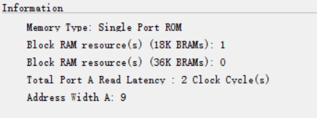 

4、 mp3模式图模储存ROM ip核

 

5、 白天/黑夜模式切换图模ROM ip核

 

6、 mp3 音量大小储存显示图模：

 

根据蓝牙传输的模式数据核由ip核当中对应位置所读取到的图片信息核摄像机拍摄到的图像信息，结合数据进行显示即得到最终智能驾驶车载系统的总体呈现情况：

自创图像存储方法——“图模”简介：

在实验过程当中，由于既要存储摄像头拍摄所得到的像素点数据，又要存储背景图像以及相关控制信号调控的vga显示图片数据，及数字钟的展示。而vivado自带提供给我们的ip核的大小不超过270个储存单元，其储存容量不足两个640*480像素大小的图片数据。如何在这种情况下进行图片压缩及呈现是我们在实验过程中研究较多的问题。

由于无法在较小的空间当中进行图像的储存，我们采用其他的数据压缩方法。由于图像的图表大多都呈现出黑白的效果，我们创新性的采用“图模”的方式及逆行图片的压缩，将对应图片的三位16进制数rgb值改为1位进行存储，存储的大小每行宽度由12变为了1，对于“图标”图像的压缩成本降至原来的1/12。该算法由手写的python算法进行实现，具体存储的图模效果图如下：

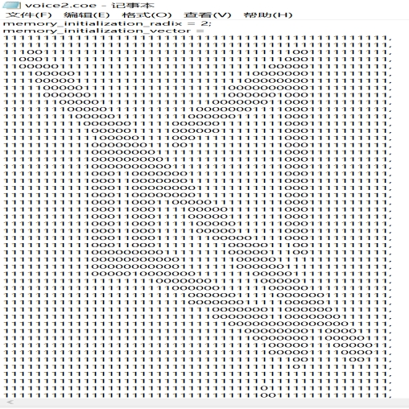 

图模压缩python代码如下：

```python
from PIL import Image
im=Image.open("D:\\ProgramFiles\\vivado_file\\pic_sources\\benben\\9.png")
f=open("D:\\ProgramFiles\\vivado_file\\pic_sources\\benben\\9.coe","w")
width = im.size[0]
height = im.size[1]
rgb_im = im.convert('RGB')
print(width)
print(height)
print(width*height)
print(hex(15))
print(str(hex(15))[-1:])
f.write("memory_initialization_radix = 16;\n")
f.write("memory_initialization_vector =\n")
for i in range(height):
    for j in range(width):
        r, g, b = rgb_im.getpixel((j,i))
        r=r//200;
        f.write(str(hex(r))[-1:])
        outCount+=1;
        if outCount==48:
            f.write(",\n")
            outCount=0;
```

**2.第二fpga开发板——顶层模块** **MY_MP3**

MY_MP3模块位第二个顶层模块，用来串联下属包括模块，同时提供直接对于外设的接口，保证了各个子模块之间的数据传输，该开发板的主要调用模块位蓝牙模块核mp3模块，主要负责的功能位通过蓝牙传输数据进行mp3的播放以及车辆驾驶模式的相关调控。

```
//
/*  模块名称：module MY_MP3
/*  功能描述：作为fpga第二板最顶层模块，用来串联下属各层模块，
/*      同时提供直接对于外设的接口，保证了各个子模块之间
/*      的数据传输
//
```

模块流程图简介：

 

 

**2.1** **MP3音频播放相关模块**

MP3相关模块为实现mp3功能的基本模块，下设按钮控制音量调节，旋转编码器控制，歌曲切换，数字钟时间计算并呈现等功能。具体包括音量调节子模块，旋转编码器获取左旋转右旋转信息模块，歌曲切换子模块，七段数码管呈现子模块，LED动态音频显示子模块等。

**SPI通信简介**

VS1003 BMP3 Board模块通过SPI接口与外部控制器连接，VS1003的控制以及音频数据都是通过SPI接口，VS1003通过7根信号线共同控制器，分别是：xRSET、XCS、XDCS、SI、SO、SCK和DREQ。其中xRSET是VS1003的复位控制线，低电平有效。DREQ是数据请求线，用于通知控制器VS1003是否可以接收数据。SI(MOSI)、SO(MISO)、SCK则是VS1003的SPI通信接口，他们在XCS和XDCS的控制下执行不同的数据通信。VS1003的SPI支持两种模式：

1，VS1002有效模式（即新模式）。

2，VS1001兼容模式。这里我们仅介绍VS1002有效模式（此模式也是VS1003的默认模式）。下表是在新模式下VS1003的SPI信号线功能描述：

 

VS1003 的 SPI 数据传送，分为 SDI 和 SCI，SDI 用来传输数据， SCI 用于传输命令。 SDI 数据传输非常简单，就是标准 SPI 通信，不过 VS1003 的数据传输都是通过 DREQ 控制，主机必须在判断 DREQ 有效（高电平有效）后，才可以发送数据，每次可以发送 32 字节。 

SCI串行总线命令接口包含了一个指令字节、一个地址字节和一个 16 位的数据字。读 

写操作可以读写单个寄存器，在 SCK 的上升沿读出数据位，所以主机必须在下降沿刷新数据。SCI 的字节数据总是高位在前低位在后。第一个字节指令字节，只有 2 个指令，也就是读和写，读指令为：0X03，写指令为：0X02。

 

从上图可以看出，向 VS1003 读取数据，通过先拉低 XCS，然后发送读指令（0X03）再 发送一个地址，最后，我们在 SO 线（ MISO）上就可以读到输出的数据了。而同时 SI（ MOSI） 上的数据将被忽略。 

SCI 的写时序如下图：

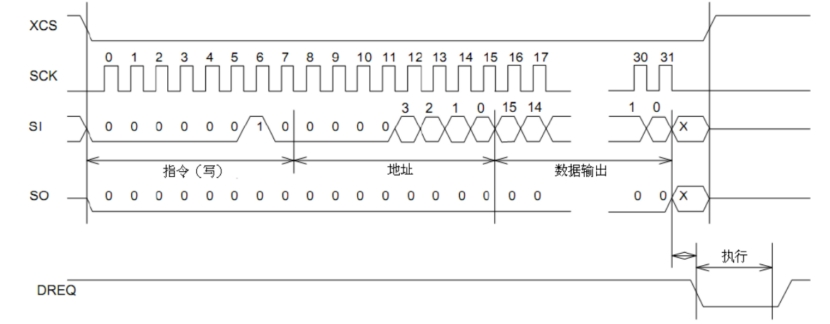 

SCI 写时序和 SCI 读时序类似，都是先发指令，再发地址。不过写时序中，我们的指令是写指令（0X02），并且数据是通过 SI 写入 VS1003 的，SO 则一直维持低电平。在上两个图中，DREQ 信号上都产生了一个短暂的低脉冲，也就是执行时间。这段时间，是不允许外部打断的。

**2.1.1MP3主模块**

MP3总主模块主要控制VS1003BMP3 Board，通过预先存于第二fpga开发板中的音频数据，按照SCI 的写时序向VS1003BMP3 Board进行信息传输，从而控制其音频播放。下设音量控制子模块、歌曲切换子模块。

1)实现过程

SCI 串行总线命令接口包含了一个指令字节、一个地址字节和一个 16 位的数据字。读写操作可以读写单个寄存器，在 SCK 的上升沿读出数据位，所以主机必须在下降沿刷新数据。SCI 的字节数据总是高位在前低位在后。第一个字节指令字节，只有 2 个指令，也就是读和写，读指令为：0X03，写指令为：0X02。

在传输的过程中，我们主要采用“写指令”的方式，将fpga开发板中的数据传入mp3当中进行播放。首先通过先拉低 XCS，然后发写读指令（0X02）再发送一个地址，最后，将16位音频数据沿SI总线进行发送即可。

2)音频选择

16位音频数据我们采用的是MIDI文件格式的音频数据（相较于原本数据长为32为的mp3格式,MIDI文件通过16进制编码器进行处理之后不需要在对于长度或其他格式信息进行调整，便可以直接发送给），首先通过16进制编码器将其转化为A65格式的16进制编码，通过C程序将其转变位COE文件按照一定的检索顺序储存在IP核当中即可。对应的接口定义如下：

```verilog
module BLUE_MP3(
    input CLK,
    output reg XRSET=1,
    output reg XCS=1,
    output reg XDCS=1,
    output reg SI=0,
    input SO,
    output reg SCLK=0,
    input DREQ,
    input rst,
    input next,
    input prev,
    input up,
    input down,
    output disp7_dot,
    output [7:0] disp7_shf,
    output [6:0] disp7_odata,
    output [15:0] led,
    output [2:0] led_rgb,
    //蓝牙
    input get_bluetooth,
    //连接
    output blue_link,
    input iA,
    input iB,
    input SW
);
endmodule 
```

**2.1.2音量调节模块**

音量调节模块通过对于蓝牙或旋转编码器传输的音量控制信号进行处理，如果感应到提高音量信号，则通过一定延迟传输提高音量vol音量信息到主模块MP3当中，否则传输降后的音量信息到主模块当中

```verilog
module inputvol(
    input clk,
    input up,
    input down,
    output reg [15:0]vol=16'h0000
    );
endmodule 
```

2.1.2歌曲切换模块

和音量调节模块相类似，歌曲切换模块同样通过对于蓝牙或第二fpga开发板上的接入按钮传输的歌曲切换的控制信号进行处理，如果感应到提高音量信号，则通过一定延迟传输切换歌曲信号sw信息到主模块MP3当中，否则传输降后的音量信息到主模块当中。

```verilog
module inputsw(
    input clk,
    input prev2,
    input prev,
    input next2,
    input next,
    output reg [2:0]sw=0
    );
endmodule

```

**2.1.3** **mp3数字钟模块**

Mp3数字中模块，调用分频器，按照美的秒一次的速度进行演示纪律，同时将“分、秒”结果返回到mp3主模块当中，调用7段数码管模块对于声音信息进行显示。

```verilog
module mustime(
    input clk,
    input rst,
    output reg [15:0] timet=0
    );
endmodule
```

**2.2** **mp3显示有关模块**

为了增加整个mp3显示器的播放选课效果，同时为了方便调试，我们充分利用fpga板子的显示装置，将能利用到的中央LED灯，16分显led灯，以及七段数码管，作为我们的音频显示装置。

**2.2.1** **七段数码管显示模块**

七段数码管为基本显示器，显示基本音乐播放信息。最左边两位为音量调节信号，10为调低音量，01为调和高音量，00为暂时不加控制信号；接着两位为曲目切换选择信号，分别为0-7表示当前播放的歌曲数目，最后四位表示当前音乐播放时间，分时点之前表示的是当前播放的“分”信息，分时点之后表示的是当前播放的“秒”时间信息。

**2.2.2** **中央16色LED灯动态显示模块**

中央led灯动态显示模块能够更具当前的音频信号进行处理，根据不同音乐播放频率为中央控制LED灯加上不同的音乐频率动态颜色效果。对于16为LED灯位置也采用相同的方式进行处理

**2.2.2.1 led对不同led应频率信号处理模块** 

通过当前的音频信号值给出对应led灯的亮灯频率（直接控制对应的位置led灯亮度）

```verilog
module timebcd(
    input [15:0] iData,
    output [15:0] oData
);//分别对应iData % 10; (iData/10)%6; (iData/60)%10;iData/600;四种不同频率的信号处理
endmodule
```

**2.2.2.2** **中央led对不同rgb颜色对应处理模块** 

通过当前的音频信号值给出中央led灯的rgb值，音频信息iData由对应地址在ip核中获取到的16位音频信息给出。

```verilog
module disprgb(
    input clk,
    input [15:0]led,
    input rst,
    output  [2:0]rgb
);
endmodule 
```

**2.3蓝牙信号处理相关模块**

通过蓝牙获取操作者发送的二进制数据，将其对应编码所代表的指令信号：包括：音量调节信号，曲目切换信号，模式调节信号等进行转换，通过“一对一”法避免滤波干扰数据解析，每一种信号用8位二进制数进行存储。将最终结果转换为其他模块可调用的形式传送到主模块当中。

**2.3.1** **蓝牙信息获取模块**

蓝牙模块利用的是 UART 协议进行传输，此蓝牙模块支持的是 8 位数据位，一位 停止位，无奇偶校验位，波特率为默认的 9600，同时为了保证传输数据的有效， 加了滤波处理模块，传入的时钟为 100Mhz 既可。

```verilog
module bluetooth(
    input clk,
    input rst,
    input get,
    output reg [7:0] out
);
endmodule 
```

**2.3.2** **蓝牙信息处理模块**

在该模块当中进行滤波处理，保证当时效性为delay的时间内获取到的数据都为目标数据，即将结果的真值赋值为目标数据信息，同时将目标数据信息转换为能够被其他模块调用的形式返回掉主模块当中进行储存。

```verilog
module deal_bluetooth(
    input  wire clk, 
    input [7:0] oper,
    output reg up,
    output reg down,
    output reg prev,
    output reg next,
    inout mp3change,
    output reg sunchange
    );
endmodule 
```

**四、testbench测试模块**

**1、camera 部分：**

用于测试 sccb 协议 

```verilog
`timescale 1ns / 1ps 
module test; 
reg clk=0; 
reg rst=0; 
wire sio_d; 
wire sio_c; 
wire reset,pwdn,xclk; 
always 
begin 
#3; 
clk=~clk; 
end 
camera_init a(clk,rst,sio_c,sio_d,reset,pwdn,xclk); 
//assign sio_d=1; 
endmodule
```

2、mp3部分，用于测试mp3音道信息：

```verilog
`timescale 1ns / 1ps
module sw_test(
    input clk,
    input prev,
    input next,
    output reg [2:0]sw=0
    );
    reg  [31:0]swdelay=0;
    always @(negedge clk) begin
        if(swdelay==0) begin
            if(prev) begin
                swdelay<=10;
                sw<=sw-1;
            end
            else if(next) begin
                swdelay <= 10;
                sw<=sw+1;
            end
        end
        else 
            swdelay<=swdelay-1;
    end
endmodule
module sw_tb;
    reg clk=0;
    reg prev=0;
    reg next=0;
    wire [2:0]sw;
    always begin

        clk<=~clk;
        #1;
    end
    sw_test psw(.clk(clk),.prev(prev),.next(next),.sw(sw));
    
    initial begin
        #10;
        prev=1;
        #10;
        prev=0;
        #20;
        next=1;
        #10;
        next=0;
        #20;
        next=1;
        #10;
        next=0;
    end
endmodule
```

**五、 实验结果展示**

1、智能车载系统总体界面状态展示：

摄像头拍摄场景位于整个车载系统的中部偏左部分，下图中三个标志分别表示mp3的状态、mp3的播放音量值以及当前选择的模式（智能模式为黑色，表示通过颜色传感器自动调节白天/夜间模式，中间为黑色表示开启手动模式，手动通过蓝牙调节当前的背景白天/夜间模式）。

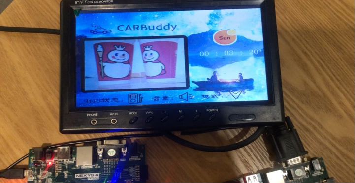 

 

 

2、智能车载系统旋转编码器控制音量效果图展示：

（7段数码管最左边两位数据表示左右旋转信息，10表示右旋，01表示左旋，00表示当前暂时没进入旋转状态）

 

 

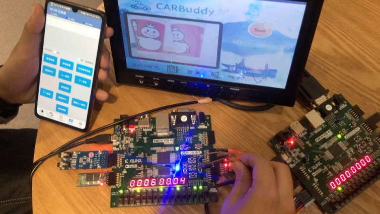 

3、颜色传感器子系统根据当前颜色调节图片背景效果图展示

（7段数码管数值1——8表示当前背景颜色最淡——>最亮）：

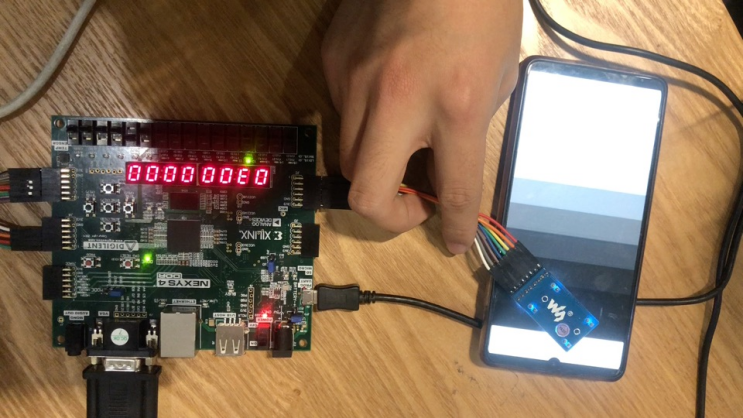 

 

 

4、蓝牙模块，手机通过控制蓝牙串口工具发送相应8位二进制数值数值，调控音量切换，曲目切换，mp3状态，以及白天/黑夜/智能模式

1）音量切换

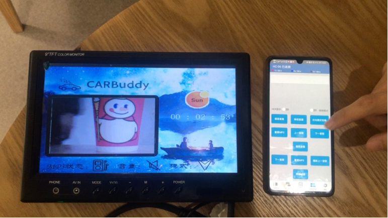 

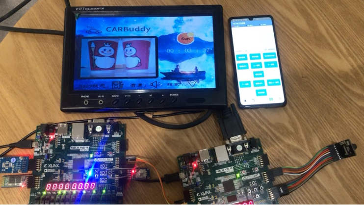 

2）白天与夜间模式控制：

白天模式：

 

夜间模式：

 

颜色传感器智能切换模式：

 

 

3）mp3播放状态切换：


 

 

5、自定义调节背景图片颜色功能展示：

根据fpga板左三开关向上向下分别表示对于背景图片的r、g、b值进行调节，点击P17按钮将色调调高，点击M17按钮将色调调低。根据使用者的喜好可据此对于背景图片的色调进行调节。

1）亮色调效果（r,g,b值均调高）

 

2）正主红色调效果：

 

3）反差主红色调效果

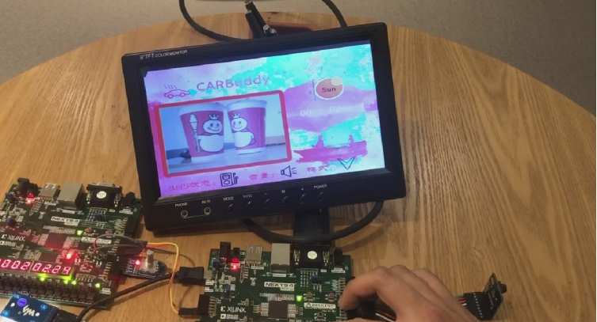 

6、双fpga板连接状态总体展示：

 

 

**六、心得体会**

课程收获 

本次大作业我们是合作进行的，对于超乎普通的6个模块而言无疑是一个较大的挑战，如何在双fpga板，6个模块之间选择一个较优的课题是我们需要考虑较大的一个问题。对于资源较多的情况下，最好的方式将资源结合的方法便是构造一个体系系统，能够将多功能进行有机结合并且能够根据现有的模块增加创造其他功能，由此，智能车载系统——CARBuddy车载智慧屏。

当然，较多的模块和功能对于模块综合的难度较大。对于单fpga板子来说尤其如此。Nexy4其ip核容量有限，最多只能存放不到两个精度为640*480的rgb图像党校，对于已经存放了640*480大小的RAM寄存器组存放摄像头拍摄的图片像素点空间，余下的ip核容量不足以支撑一张CARBuddy背景图片的存放。为此我们必须要思考解决ip核容量不足的方法。为此，“图模”的思想便诞生了。“图模”即是我们在进行图片压缩的过程当中自创的一种方法，将原本储存图片的rgb值12位数据压缩成1位数据，表示当前位置是否有像素存在。该方法的作用对于黑白标识符（如音量标识符、mp3状态标识符、数字钟1——9数字显示尤其明显），具体在进行图模压缩和制作过的程附于附录之中。

除了图模之外，如何将MP3播放的音乐数据于VGA开发板上进行显示，同时当汽车运行时间超过1h时候自动开启反向数据传输系统，通过第一fpga开发板传数据传输回第二fpga开发板，调用MP3播放器开启疲劳驾驶提示音。当驾驶员察觉到关闭装在第一fpga开发板上的警报按钮之后第二fpga开发板上的警报播放将会自动终止，同时继续之前播放的曲目继续播放。这类似功能的实现离不开双fpga板之间的信息交互。我们通过输入输出（两条）总线的方式第二fpga开发板上的信息和第一fpga开发板上信息的双向传递功能，由于时间限制和实现的方便性，我们通过电平信号进行控制，及所需要传递的状态数位2的线位数幂次倍。还未能实现单个总线的方式对于索要调控数据的分时传输，（不仅较为复杂，难以在单个始终时间内传递多个数据）同时较难在第二开发板上根据不同的时序进行解析。该点是我们项目所做的不足的地方。相信如果有更多的时间，如在寒假期间能够继续进行开发项目，会在双fpga板子之间的信号传输方面有所突破。

（2） 对于国内外数字芯片设计的看法 

ziiMedia Research(艾媒咨询)数据显示，2019年中国AI芯片市场规模约为115.5亿元，在5G商用的普及和政策、技术等各因素的推动下，AI芯片有望在云计算、安防、消费电子、机器人等领域实现大规模商用，预计2021年AI芯片市场规模将达到436.8亿元。但值得注意的是，随着人工智能技术的加速普及，下游应用领域对AI算力和能耗的要求越来越高，传统冯诺依曼架构式芯片的瓶颈逐渐显露，AI芯片将朝着存算一体化方向发展。

中国步入技术驱动增长的高质量发展阶段，政策将持续加码推动芯片全面国产化

中国数字经济产业已经成为驱动经济增长的新动能，2019年数字经济规模占GDP的比重达36.2%;作为数字经济产业底层基础的集成电路，却严重依赖进口，2020年前八个月，中国集成电路进口金额超过万亿元;未来政策将持续加码发展集成电路产业，实现芯片全面国产化。中国AI芯片有望引领国产芯片实现弯道超车，预计2023年中国AI芯片市场规模将突破千亿元5G基站、大数据中心、人工智能等新型基础建设的完善，促使AI芯片成为引领芯片行业未来发展的重要方向;政策、资本、技术、市场等多重因素将驱动AI芯片这一新赛道快速发展，中国芯片有望实现弯道超车;预计2023年中国AI芯片市场规模将超过千亿元。存算一体化AI芯片是未来主流方向，受益于下游需求的强劲驱动力而快速发展人工智能产业的成熟化发展驱动AI芯片由通用型向专用型发展，急剧增长的数据量对AI芯片的性能以及能耗提出了更高要求;能够兼具性能和成本的存算一体化AI芯片符合未来发展趋势，在下游需求的推动下有望快速发展。

最近几年，国产芯片突飞猛进，2019年国产芯片产值超过3000亿人民币，首次超过全球芯片产值的10%。芯片行业，遇到了千载难逢的机会。芯片企业，如雨后春笋般涌现，到2019年底国内芯片企业数量已有1780家。先有数量再有质量，中国走这样的芯片成长之路，也无可厚非。但做芯片很烧钱，必须有持续的资金支持，成功往往需要十年。数字芯片设计制造，大体上便是指的国内外 IC 行业的发展现状。就我收集到以及了解到的信息来看，中国进口量占了全球半导体产业的 2/3，虽然近年来中国在 IC 行业的投入加大，但中国芯片能够达到自给自足的程度还任重而道远。 在国内，IC 行业比较有名的公司便是海思和紫光展锐，但是除了这两个公司以外，国内其他企业的自给率接近 0%。但也正是如此，我国现在正在鼓励快速发展 IC 行业，目前，我国的半导体封装企业已经达到了 120 多家，我国 IC 行业的相关工程师数量也在不断增多，大家也都不仅仅从事软件行业，硬件越来越成为工作的主流方向。我国的 IC 封装业也因此正在迅速崛起。据统计，我国封测产品中先进封装技术占比由2008年的不足5%快速增长到 2017 年的超过 30%。 

从最近的国家政策以及行业趋势来看，我国国内本土化市场需求正在变的越 

来越庞大，国家也在不断地提供相应的资金与政策，鼓励 IC 创业公司的发展， 

数字芯片的需求量也是越来越大，对于人才的需要才是越来越多。尤其是在上海，北京，深圳这些一线城市，硬件人才可以说是十分紧缺。在当今时代，IC 行业，数字芯片，硬件的设计与发展，是潮流，也是趋势。虽然说我国的硬件方面起步较晚，但是近些年来也是在奋起直追，急需优秀的硬件工程师，数字芯片的自给生产也是中国今后发展所不可回避的问题。因此，在今后的学习 当中，我们也应该更加重视硬件的设计与发展，迎合国家政策与时代潮流，争取不仅仅只注重软件能力的培养，同时也要兼顾硬件，努力向着全面发展的方向迈进！

 

 

 
